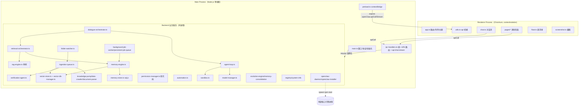
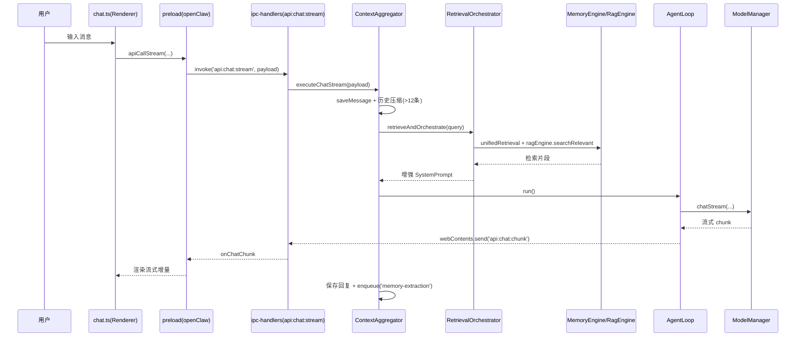
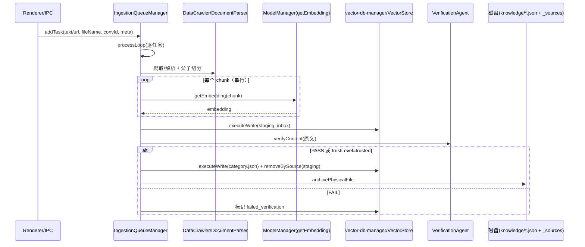
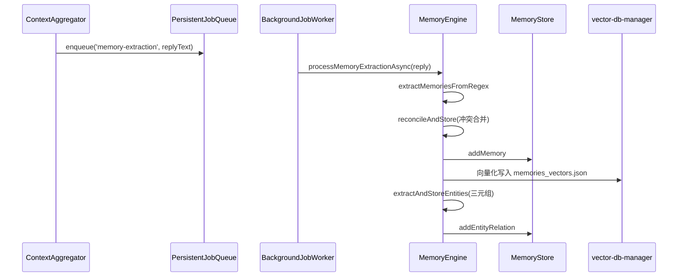

# OpenClaw 智能助手 — 架构与代码分析报告

> 分析对象：`D:\Code\OpenClawAssistant_Source`（Electron 桌面 AI 助手）
> 分析范围：主进程（`src/main/`）、后端服务（`src/backend/`，约 24 个模块）、渲染进程（`src/renderer/`）、类型与静态资源、测试配置
> 方法：基于真实源码的逐文件阅读 + Grep/结构化检索；所有结论均附 `文件:行号` 证据
> 说明：本报告为**纯分析**，未修改任何源文件

---

## 1. 项目概览

### 1.1 技术栈（与实际代码核对）

| 维度 | 实际情况（代码证据） | 备注 |
|------|------|------|
| 运行时 | Electron（主进程 + 渲染进程双进程） | `package.json:66` electron ^42 |
| 渲染层 | **原生 TypeScript + 自定义 ES Module + Hash 路由**，**未使用 React/Vue/MUI** | 与“Vite+React+MUI”假设不符；页面为 `pages/*.ts` 动态 `import()` |
| 主进程语言 | `require`/CJS 与 `import`/ESM 混用 | `main.ts` 用 `require`，多数 backend 用 `export` |
| 数据库 | `sql.js`（WASM SQLite，全量内存库） | `memory-store.ts:7,30` |
| 向量/检索 | 自研 `VectorStore`（JSON 文件 + 余弦/BM25 线性扫描），`rag-engine`（双字 Bi-gram） | `vector-store.ts`, `rag-engine.ts` |
| 大模型接入 | OpenAI/Anthropic 兼容 HTTP + 本地 Ollama/LM Studio | `model-manager.ts` |
| 其他依赖 | cheerio、chokidar、officeparser、pdfjs-dist、tesseract.js、uuid、ws、express、cors、iconv-lite | `package.json:47-59` |

### 1.2 进程模型

- **Main Process（Node.js 单线程）**：承载窗口管理、`claw://` 自定义协议、`ipc-handlers` 统一路由，以及**全部 backend 业务服务**（model-manager、memory-store、sandbox、agent-loop、rag、记忆引擎、ingestion 队列、后台任务等）——所有服务与主进程**同线程**运行，共享一个事件循环（`main.ts:480-590` 用 `require` 实例化并注入 `ipc-handlers`）。
- **Renderer Process（Chromium）**：受 `contextIsolation: true` + `nodeIntegration: false` 保护，仅通过 `preload.ts` 的 `contextBridge` 暴露的 `window.openClaw` 对象与主进程通信（`preload.ts:14-99`）。
- **进程边界 / IPC 桥梁**：渲染层 `utils.ts` 的 `api` 封装把“伪 REST”请求（`apiCall(url, options)`）转成 `ipcRenderer.invoke('api:call', {url, options})`；流式对话走 `api:chat:stream` + `api:chat:chunk` 事件（`utils.ts:5-14,20-40`）。**注意：这里表面上像 HTTP API，实际是字符串 URL 路由，没有强类型契约。**

---

## 2. 目录与模块结构总览

```
src/
├── main/
│   ├── main.ts            # 入口：建窗/协议/后端初始化/IPC 注册
│   ├── preload.ts         # contextBridge 暴露 openClaw API
│   └── ipc-handlers.ts    # 统一 api:call URL 路由 + api:chat:stream
├── backend/               # 约 24 个业务模块（见下表）
├── renderer/
│   ├── app.ts             # Hash 路由/外壳/主题/导出
│   ├── utils.ts           # api 桥接 + 工具 + 轻量 Markdown 解析
│   ├── components.ts      # toast / modal
│   ├── float.ts           # 悬浮球逻辑
│   ├── screenshot.ts      # 截图 UI
│   └── pages/             # chat/memory/knowledge/skills/plugins/settings/experts/market/model-market/core-manager
├── types/                 # openclaw.d.ts / global.d.ts
└── assets/data/           # cloud-vendors.json / local-marketplace.json
tests/                     # unit(6) + manual(1)
```

### 后端模块职责速查

| 模块 | 职责 | 关键依赖 |
|------|------|---------|
| `model-manager.ts` | 模型配置/API Key 加解密/chat·chatStream/getEmbedding/getRerankScore/本地引擎端口探测 | safeStorage、Ollama |
| `memory-store.ts` | sql.js 持久化（记忆/对话/消息/实体/情景/任务表），同步全量落盘 | sql.js |
| `sandbox.ts` | 命令风险判定与执行（Docker→宿主降级），权限授予/撤销 | child_process |
| `permission-manager.ts` | RBAC 角色权限（**实际未被调用**） | 无 |
| `automation.ts` | PowerShell 键鼠/窗口/截屏自动化（**字符串拼接，注入风险**） | child_process |
| `agent-loop.ts` | ReAct 循环，拦截 `<execute>`/JSON 工具调用并交给 sandbox 执行 | model-manager, sandbox |
| `dialogue-orchestrator.ts` | `ContextAggregator`：历史压缩+检索融合+驱动 AgentLoop+记忆抽取入队 | 上述各引擎 |
| `retrieval-orchestrator.ts` | 三路召回（记忆/知识/情景）+ 字符预算分配 | memory-engine, rag-engine |
| `memory-engine.ts` | 双轨记忆抽取/冲突合并/实体三元组/情景摘要/统一检索（艾宾浩斯） | model-manager, memory-store, vector-db-manager |
| `rag-engine.ts` | **模块级单例**，按会话的内存 Bi-gram 切片检索 | 无（内存） |
| `vector-store.ts` | 内存 JSON 向量库，余弦+BM25 线性检索 | fs |
| `vector-db-manager.ts` | **单例**，VectorStore 缓存 + 按路径互斥锁 | vector-store |
| `registry.ts` | 静态模型/插件/技能市场数据（硬编码） | 无 |
| `knowledge-pump.ts` | 知识蒸馏泵（启动 ingestion 循环） | ingestion-queue |
| `ingestion-queue.ts` | 摄取队列 processLoop：爬取/解析/嵌入/核查/晋升 | data-crawler, document-parser, verification-agent |
| `folder-watcher.ts` | chokidar 监听目录→入队 | chokidar |
| `background-job-worker.ts` / `persistent-job-queue.ts` | 后台持久化任务队列 worker | memory-store |
| `document-parser.ts` | 父子分块 + 多模态（pdf/tesseract）文本抽取 | pdfjs, tesseract, officeparser |
| `data-crawler.ts` | URL 正文抓取（cheerio） | cheerio |
| `verification-agent.ts` | LLM 事实核查/鉴伪 | model-manager |
| `evolution-engine.ts` | 失败自进化反思 | model-manager |
| `memory-consolidation-pipeline.ts` | 记忆去重重排 | model-manager, memory-store |
| `system-info.ts` | 系统信息 | os |
| `openclaw-daemon.ts` / `openclaw-installer.ts` | 核心引擎拉起/克隆安装（**供应链风险**） | git/npm |
| `parser-worker.ts` / `test_agent.ts` | Worker 线程解析 / E2E 测试替身 | 无 |

---

## 3. 架构图（Mermaid）



> 进程边界：Renderer 与 Main 之间只有 `preload` 暴露的有限 API；所有 backend 服务均运行在 Main 的同一 Node 线程，无独立 worker 进程（仅 `parser-worker.ts` 为 Worker 线程）。

---

## 4. 模块职责与依赖关系

### 4.1 依赖要点（文字）

- **对话主链路**：`chat.ts → preload → ipc-handlers(api:chat:stream) → ContextAggregator → AgentLoop → ModelManager`。`ContextAggregator` 在每轮对话中同步调用 `RetrievalOrchestrator`（融合 `MemoryEngine.unifiedRetrieval` 与 `ragEngine.searchRelevant`），再组装 System Prompt 驱动 `AgentLoop`（`dialogue-orchestrator.ts:22-161`）。
- **知识摄取链路**：`folder-watcher`/`/knowledge/add` → `IngestionQueueManager.addTask` → `processLoop` → `DataCrawler`/`DocumentParser` 解析切分 → 逐块 `getEmbedding` → 写入 staging（`vectors_staging_inbox.json`）→ `VerificationAgent.verifyContent` → 通过则 `executeWrite(category.json)` 并 `archivePhysicalFile`（`ingestion-queue.ts:160-313`）。
- **记忆抽取链路**：`ContextAggregator` 在对话结束后 `jobQueue.enqueue('memory-extraction', {replyText})`（`dialogue-orchestrator.ts:148-150`）→ `BackgroundJobWorker` → `MemoryEngine.processMemoryExtractionAsync` → 正则抽取→冲突合并→实体三元组→向量化（`memory-engine.ts:471-479`）。
- **强耦合点**：`ipc-handlers.ts` 是“上帝路由”，直接 `require` 并调用几乎所有 backend 模块；backend 模块之间也大量互相 `require`（如 `memory-engine` 反复 `require('./vector-db-manager')`）。缺乏接口抽象，依赖图近乎全连通。

### 4.2 调用关系表（核心）

| 调用方 | 被调用方 | 触发点（证据） |
|------|------|------|
| `ipc-handlers` | `modelManager/memoryStore/sandbox/automation/queueManager/folderWatcher/permissionManager` | `ipc-handlers.ts:577-589`（注入） |
| `ContextAggregator` | `RetrievalOrchestrator` | `dialogue-orchestrator.ts:89-97` |
| `ContextAggregator` | `AgentLoop` | `dialogue-orchestrator.ts:113-138` |
| `AgentLoop` | `sandbox.execute` | `agent-loop.ts:79` |
| `RetrievalOrchestrator` | `MemoryEngine.unifiedRetrieval` + `ragEngine.searchRelevant` | `retrieval-orchestrator.ts:37,51` |
| `IngestionQueueManager` | `DataCrawler`/`DocumentParser`/`VerificationAgent`/`vectorDbManager` | `ingestion-queue.ts:201-284` |
| `folder-watcher` | `IngestionQueueManager.addTask` | `folder-watcher.ts:93` |
| `main.ts` | 全部 backend 单例 | `main.ts:480-590` |

---

## 5. 关键数据流（典型路径）

### 5.1 聊天请求（含 RAG + Agent）



### 5.2 知识摄取（文件夹监听 / 手动上传）



### 5.3 后台记忆抽取



---

## 6. 不足分析

> 优先级：🔴 高（安全/正确性或易利用）｜🟠 中（架构/性能/可维护）｜🟡 低（代码质量细节）

### 6.1 架构层面

- **A1 🔴 单体 IPC 路由，严重耦合**：`ipc-handlers.ts` 用一条约 1400 行的 `if (url === ...)` 链承载全部业务逻辑，违反单一职责、难以测试与维护。更明显的是 **`/memory` 路由被处理了两次**（第一处 `262-451`，第二处 `1034-1055`），逻辑重复且易漂移。
  - 证据：`src/main/ipc-handlers.ts:17-1433`；重复块 `262-451` vs `1034-1055`。
- **A2 🟠 分层不清晰、进程模型混杂**：所有 backend 服务与主进程同线程（`main.ts:480-590` 直接 `require` 实例化并注入）。渲染层通过“伪 REST”字符串 URL 调用，路由靠正则/前缀匹配，而非强类型接口，缺乏 service/domain 边界。
- **A3 🟠 全局单例/可变状态滥用**：`rag-engine` 的 `ragEngine` 是模块级单例，跨**所有会话**共享一个 `chunks` 数组且无持久化（`rag-engine.ts:94`）；`vector-db-manager` 是单例且缓存**永不清理**（`vector-db-manager.ts:83-85`）；`MemoryStore` 单例全量内存库。全局可变状态导致不可预测的内存增长与跨会话耦合。
- **A4 🔴 权限/RBAC 是死代码**：`PermissionManager` 定义了完整角色权限体系（admin/user/guest）与 `checkPermission`，但全代码库**无任何调用**（Grep `checkPermission` 仅出现在定义处 `permission-manager.ts:109`）；所有 IPC 路由不鉴权，默认角色 `admin`。这是典型“安全假象”。
- **A5 🟠 错误处理/容错不一致**：`ipc-handlers` 统一 try/catch 抛出原错误（`1430-1432`），但大量内部 `setImmediate(async()=>{...})` 静默吞掉异常（如记忆导入 `302-315` 的 `catch(e){}`）。`MemoryEngine` 在大模型解析失败时普遍退化为“直接新增”（`memory-engine.ts:177-185`），可能把错误/幻觉记忆入库。
- **A6 🟠 扩展性差**：新增模型/插件/技能靠 `registry.ts` 硬编码静态数组（`registry.ts:19-418`）；插件“安装”仅写 JSON **不加载任何代码**（`ipc-handlers.ts:1247-1257`），无法真正扩展能力。新增 RAG 数据源/embedding 后端需在多处散落修改（`getEmbedding` 硬编码 Ollama）。
- **A7 🟡 配置管理分散**：配置散落在 `settings.json / permissions.json / models.json / global-config.json / skills.json / plugins.json / sandbox-permissions.json / custom-path.json` 等，无统一配置层；且多个模块每次操作都即时 `fs.readFileSync(JSON.parse)` 同一 `settings.json`（如 `ingestion-queue.getTargetModel` 每个任务读盘 `135-142`）。

### 6.2 安全层面

- **S1 🔴 沙盒在 Docker 缺失时退化为宿主机直接执行，且低风险命令免确认**：`sandbox.ts:223` `if (riskLevel === 'low' || isAuth) return this._runCommand(...)`（**无确认**）；当 `_isDockerAvailable()` 为 false 时，`_runCommand` 直接用 `spawn(shell, [command], {env:{...process.env}})` 以**当前用户完整权限**执行（`sandbox.ts:352-413`）。结论：默认（绝大多数用户无 Docker）下，“沙盒”名不副实，LLM/用户可**静默在宿主机执行任意命令**。
- **S2 🔴 风险判定可被轻易绕过**：`getRiskLevel` 仅靠正则关键词（`sandbox.ts:7-42`）。绕过手段众多：`powershell -enc <base64>`、`python -c "import os;os.system('...')"`、`.NET` 反射调用、变量拼接、别名等；且 `powershell|cmd|wscript` 仅判为 medium（仍需确认），而 `python x.py`、`copy`、`mkdir` 等判为 **low 直接放行**。命令注入/沙盒逃逸风险高。
- **S3 🔴 API Key 加密形同虚设**：`model-manager.ts:18` 硬编码 `FALLBACK_SECRET = 'openclaw-default-api-key-safe-salt'`；当 `safeStorage` 不可用时（开发或未打包 Electron 常见），用 `scryptSync(FALLBACK_SECRET,...)` 派生密钥做 AES 加密（`model-manager.ts:31-41`）。密钥随源码分发，任何人可解密 `models.json` 中的 API Key → **明文泄露**。
- **S4 🟠 IPC 鉴权缺失 / apiToken 装饰性**：`preload` 暴露 `apiToken`（`preload.ts:9,14`），`main` 在 `system:getApiToken` 校验 `senderUrl`（`main.ts:212-219`），但 `api:call` 通道（`ipc-handlers.ts:17`）**从不校验该 token 或任何权限**，任何渲染上下文可调用任意业务路由。token 仅作“向下兼容”装饰。
- **S5 🔴 PowerShell 命令注入（automation.ts）**：`typeText/sendKeys/focusWindow/launchApp/openFile` 用字符串插值拼接 PowerShell 脚本，仅对单引号转义（`automation.ts:68,162,174,242,252`），未转义 `$(...)`、反引号、分号、`{}` 等。LLM/工具可控文本可逃逸执行任意 PowerShell（如 `typeText('$(Get-Process)')`、`focusWindow("x'); Start-Process calc; '#")`）。
- **S6 🔴 供应链/代码执行风险（installer/daemon）**：`openclaw-installer` 从第三方镜像 `https://kgithub.com/gengliang1999/OpenClaw1999.git` 浅克隆（`--depth 1`，无 commit pin、无签名校验），随即 `npm install`（可能触发 postinstall 脚本）并由 `openclaw-daemon.start()` 执行 `npm start`（`openclaw-installer.ts:110,117`；`openclaw-daemon.ts:55-58`）。若镜像/仓库被控，可在用户机器执行任意代码；`bind-path` IPC 可把 `installDir` 指向任意目录（`ipc-handlers.ts:1377-1383`）。
- **S7 🟠 claw:// 协议路径穿越**：`main.ts:392-405` 的 `protocol.handle('claw', ...)` 仅做 `path.normalize`，**未校验规范化后路径是否仍位于允许目录内**，`claw://app/../../...` 可读取 `renderer/` 之外的任意本地文件；且注册时 `bypassCSP: true`（`main.ts:23-35`），进一步放大影响面。
- **S8 🟠 缺少输入/路径校验**：`/system/parseDocument` 直接信任 `body.filePath` 并 `fs.readFileSync`/`officeparser.parseOfficeAsync`（`ipc-handlers.ts:1064-1140`）；`/knowledge/files/content` 用 `source` 拼路径读文件（`ipc-handlers.ts:574-588`）。无路径白名单/规范化校验，存在任意文件读取风险。
- **S9 🟠 人为确认回路（HITL）在 UI 缺失**：`AgentLoop` 遇高风险命令触发 `onRequiresConfirmation` 并经 IPC 发送 `requires_confirmation` chunk（`agent-loop.ts:82-86`；`dialogue-orchestrator.ts:121-129`），但渲染端 `chat.ts` **对该类型无处理逻辑**（Grep 显示仅 `test_agent.ts` 消费）。结果：高风险命令既不执行、用户也无从批准——确认功能实际失效；同时意味着 agent 经 `AgentLoop` 只能执行 **low 风险**命令（sandbox 中 medium/high 均 `needsConfirmation`）。

### 6.3 性能层面

- **P1 🔴 sql.js 全量同步落盘阻塞主线程**：`memory-store._save()` 每次写都 `db.export()` 整个库并 `fs.writeFileSync`（同步）（`memory-store.ts:151-161`）；而 `addMemory/deleteMemory` 等**直接调用 `_save()`（非 debounce）**（`memory-store.ts:192,243`）。大库时每次操作都是 O(N) 全量序列化 + 同步磁盘 IO，**直接阻塞主进程事件循环**，导致 IPC/UI 卡顿。
- **P2 🟠 向量检索线性扫描 + 全量 JSON 读写**：`vector-store.search` 对全部文档做 O(N) 余弦 + BM25（`vector-store.ts:117-166`），无 ANN 索引；每个 `VectorStore` 每次 add/remove 都 `save()` 整个 JSON（含嵌入向量，常 768+ 维），知识库增大时 IO 与内存成本骤增。多处 `new VectorStore(dbPath)` 后每次请求重新 `load()` 全量 JSON（如 `/knowledge/search:483-484`、`/memory POST:385-386`），重复磁盘读取。
- **P3 🔴 Embedding 串行且强依赖本地 Ollama，失败静默退化为随机向量**：`ingestion-queue.executeTask` 逐块 `getEmbedding`（串行 await，`ingestion-queue.ts:227`），大文档=数十次网络往返；`model-manager.getEmbedding` 硬编码 Ollama `nomic-embed-text`（`model-manager.ts:255-263`），**Ollama 未运行则返回随机 3 维向量兜底**（`model-manager.ts:275`），使检索质量在嵌入服务不可用时退化为随机——且静默无感。
- **P4 🟠 主线程密集计算**：`chatStream` 虽为异步 IO，但 `AgentLoop` 的“思考-执行-再思考”递归、历史压缩摘要、记忆抽取等会占用主线程；`MemoryEngine.unifiedRetrieval` 三路并发 `getEmbedding` 在主进程产生密集计算。长对话 + 多路检索时主进程压力明显。
- **P5 🟠 chokidar 资源占用**：`folder-watcher` 用 `persistent:true, depth:5`（`folder-watcher.ts:39-48`）；`handleFileChanged` 触发“删+增”整文件重新解析（`folder-watcher.ts:104-111`）。若监听含大量文件或频繁变动的目录（如 `node_modules`），会反复触发解析+嵌入，资源与 API 调用激增；仅忽略点文件，未忽略 `node_modules/dist` 等。
- **P6 🟠 Reranker 是伪实现**：`getRerankScore` 仅做 `text.includes(query)` 的 0.1/0.5 打分（`model-manager.ts:235-246`），但 `/knowledge/search` 用它按 **60% 权重**重排（`ipc-handlers.ts:491-495`）。检索精度无真实提升，且“企业级 Cross-Encoder Reranker”之名与实际实现严重不符（正确性+性能双问题）。

### 6.4 代码质量层面

- **Q1 🔴 大量 `@ts-nocheck` + 普遍 `any`**：Grep 显示约 **20 个源文件**含 `@ts-nocheck`（含几乎所有 backend 核心：`agent-loop`、`automation`、`evolution-engine`、`memory-store`、`model-manager`、`permission-manager`、`registry`、`system-info`，以及 `main/ipc-handlers` 与多个 renderer 页面）。`ipc-handlers.ts` 参数大量 `any`（`body:any`、`payload:any`），`AgentContext.messages:any[]` 等。导致 `npm run typecheck`（`tsc --noEmit`）对关键路径**无实际类型保障**。
- **Q2 🔴 测试无法运行 / 覆盖极低**：`package.json` 的 `test` 脚本为 `echo "Error: no test specified" && exit 1`（`package.json:14`），而 `jest.config.js` 已配置、`tests/unit` 下存在 6 个测试文件。即 `npm test` **必然失败**，没有任何 CI 能跑通；实际覆盖仅 memory/vector-db-manager/dialogue-cleaner 等少数模块。
- **Q3 🟠 重复代码**：`ipc-handlers` 两处 `/memory` 处理（`262-451` 与 `1034-1055`）；多处出现 `const memVecStore = new VectorStore(...); await memVecStore.load(); await memVecStore.addDocuments(...)`（如 `ipc-handlers.ts:303-315, 334-346, 384-397`、`main.ts:511-525`、`memory-engine.ts:188-200`），可下沉为统一 helper。
- **Q4 🟠 模块风格混用（ESM vs CJS）**：`model-manager/memory-store/permission-manager/automation/registry/system-info/evolution-engine` 用 `module.exports`（CJS）+ `require`，而 `agent-loop/vector-store/dialogue-orchestrator` 用 ESM `export/import`；`main.ts` 用 `require('../backend/model-manager')` 混合加载。风格不一致、易在重构时断裂。
- **Q5 🟠 日志/错误处理不一致**：`console.log/warn/error` 散落各处；`main.ts` 把 console 重定向到 `openclaw.log` 但用**同步** `fs.appendFileSync`（`main.ts:467-478`），高频日志会同步阻塞；部分路径用 `setImmediate` 吞异常（如 `ipc-handlers.ts:302-315` 的 `catch(e){}`）。日志无级别/结构化。
- **Q6 🟡 死代码/未用导出**：`PermissionManager` 完全未被调用（见 A4）；`registry` 中 `AUTO_INSTALL_SKILLS` 等字段用途待确认；`model-manager` 的 `getRerankScore` 实为占位；`preload.apiToken` 未被校验；`system-info.ts` 疑似仅在某页面引用。`chat.ts` 内联了与 `utils.ts:218` 重复的 Markdown 解析逻辑。
- **Q7 🟡 魔法字符串/脆弱解析**：`ipc-handlers` 自写 `getQueryParam` 解析 URL query（`ipc-handlers.ts:1486-1497`），不如直接用 `URL`；对话内容以字符串或 JSON 混存（`memory-store.saveMessage` 把对象 `JSON.stringify` 后存，读取时再 `JSON.parse`，`chat.ts` 与 `dialogue-orchestrator` 多处容错 parse）；System Prompt 通过字符串拼接注入（`dialogue-orchestrator.ts:92-108`），易因模型输出含特殊标记而错位。

---

## 7. 待明确事项（需产品/主程确认）

1. **沙盒策略**：是否计划将 sandbox 默认改为“强制容器（Docker/WASM）”或至少对 low/medium 风险也默认要求确认？当前“无 Docker 即宿主机执行”是否符合预期（S1/S2）？
2. **鉴权落地**：`PermissionManager` 的 RBAC 是否要真正接入 IPC 路由？`apiToken` 是否要改为每次 `api:call` 校验（S4/A4）？
3. **嵌入服务依赖**：Ollama 是否作为必装依赖？`getEmbedding` 的“随机 3 维向量”兜底是否可接受（P3）？是否接入多 embedding 后端并加超时/熔断？
4. **claw:// 协议**：是否要补“规范化后路径必须位于 `dist/` 内”的白名单校验以消除路径穿越（S7）？
5. **测试与 CI**：是否要把 `npm test` 接回 jest（`tests/unit` 已有 6 个用例），并补充对 `ipc-handlers`/sandbox/agent-loop 的测试（Q2）？
6. **registry 数据**：静态市场数据（`registry.ts`）是否要后端化/签名，避免被篡改或过期（A6/S6 相关）？
7. **插件机制**：当前插件仅为元数据 JSON、不加载代码（`ipc-handlers.ts:1247-1257`），是否符合“插件”的产品定义？是否需要真实的沙箱化插件加载？
8. **RagEngine 单例**：跨会话共享内存切片、无持久化（`rag-engine.ts:94`）是否为临时方案？大文档会话下内存增长是否在评估范围内（A3/P2）？
9. **供应链**：核心引擎克隆源（`kgithub.com/...`）是否经过审计？是否要改为固定 commit pin + 签名校验（S6）？
10. **技术栈偏差**：实际为原生 TS + 自定义 Hash 路由，**并非**需求描述中的 React/MUI；后续是否要迁移到框架以统一 UI 工程化（Q4 相关）？

---

### 附：关键证据索引（便于复核）

| 主题 | 文件:行 |
|------|---------|
| 单体路由/重复 /memory | `src/main/ipc-handlers.ts:17-1433`, `262-451`, `1034-1055` |
| sandbox 宿主降级/低风险免确认 | `src/backend/sandbox.ts:223`, `279-413` |
| 风险正则可被绕过 | `src/backend/sandbox.ts:7-42` |
| RBAC 死代码 | `src/backend/permission-manager.ts:109`（无调用方） |
| API Key 硬编码兜底密钥 | `src/backend/model-manager.ts:18,31-41` |
| apiToken 不校验 | `src/main/preload.ts:9,14`；`src/main/ipc-handlers.ts:17` |
| PowerShell 注入 | `src/backend/automation.ts:68,162,174,242,252` |
| 引擎克隆/启动供应链风险 | `src/backend/openclaw-installer.ts:8,110,117`；`src/backend/openclaw-daemon.ts:55-58` |
| claw:// 路径穿越 + bypassCSP | `src/main/main.ts:23-35,392-405` |
| HITL 确认 UI 缺失 | `src/backend/agent-loop.ts:82-86`；`src/backend/dialogue-orchestrator.ts:121-129`；`chat.ts` 无处理 |
| sql.js 同步全量落盘 | `src/backend/memory-store.ts:151-161,192,243` |
| 向量线性扫描/全量 JSON | `src/backend/vector-store.ts:117-166` |
| Embedding 随机兜底 | `src/backend/model-manager.ts:255-275` |
| Reranker 伪实现 | `src/backend/model-manager.ts:235-246`；`ipc-handlers.ts:491-495` |
| 大规模 @ts-nocheck | 约 20 文件（见第 6.4 节 Q1） |
| test 脚本占位 | `package.json:14` |
| 嵌入串行 | `src/backend/ingestion-queue.ts:227` |
| chokidar 配置 | `src/backend/folder-watcher.ts:39-48,104-111` |
