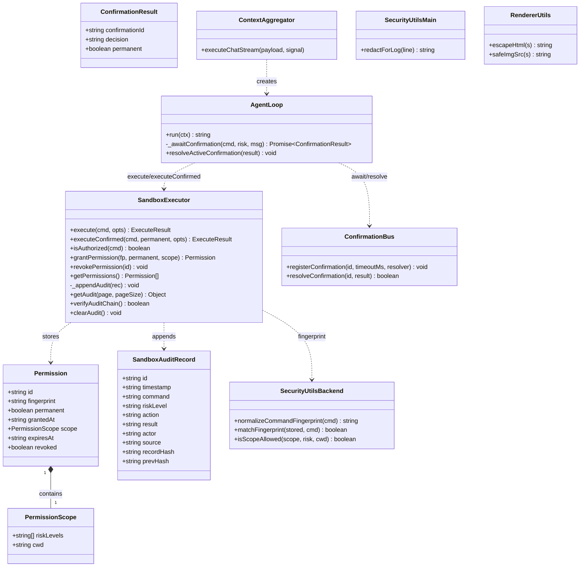
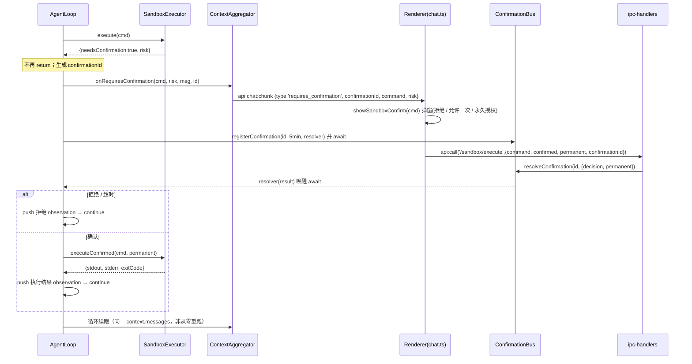
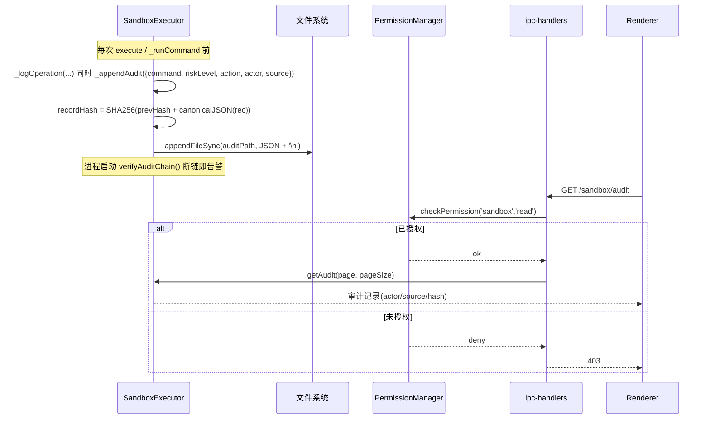
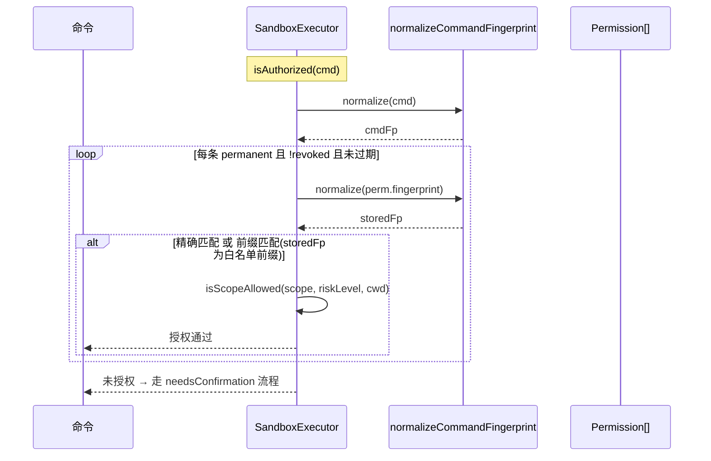
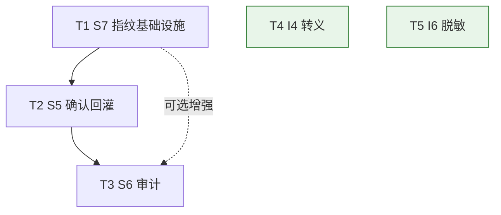

# OpenClaw Assistant P1/P2 安全加固 —— 系统架构设计 + 任务分解

> 架构师：高见远（Gao）｜基于 PRD `security-p1p2-prd.md` 与 `文档二_现有问题诊断报告.md`
> 范围：S5（确认回灌）/ S6（防篡改审计）/ S7（授权指纹）/ I4（统一转义）/ I6（日志脱敏）
> 约束：沿用现有 Electron 42 + 原生 TypeScript 分层架构，**不引入任何新框架（React/Vue/MUI 等）**；改动全部 in-place。

---

## 0. 实测核实行号与偏差（重要，供工程师校准）

我逐文件通读了源码并核实了 PRD 标注「待核实」的行号。**结论：sandbox.ts / agent-loop.ts / dialogue-orchestrator.ts / ipc-handlers.ts / components.ts / utils.ts / main.ts 标注行号基本准确；但渲染层注入点与 S5 UI 接线存在显著偏差。**

| 文件 | PRD 标注 | 实测结果 | 结论 |
|---|---|---|---|
| `src/backend/sandbox.ts` | Permission 10-15；isAuthorized 161-174；grantPermission 434-444；_logOperation 127-144；_saveLogs 112-121；getLogs 468-475；console 274/361 | 全部吻合 | ✅ 准确 |
| `src/backend/agent-loop.ts` | 闭环断裂点 127-135 | `needsConfirmation` 时 `onRequiresConfirmation(...); memoryStore.saveMessage(...); return finalMergedResponse;`（131-135）吻合 | ✅ 准确 |
| `src/backend/dialogue-orchestrator.ts` | onRequiresConfirmation 131-133 | 类名为 `ContextAggregator`；onRequiresConfirmation 实现 131-139，向渲染层发 `requires_confirmation` | ✅ 准确（类名不同，注意） |
| `src/main/ipc-handlers.ts` | `/sandbox/execute` 1273-1279 | 1273-1281，已支持 `confirmed/permanent` → `executeConfirmed` | ✅ 准确 |
| `src/renderer/components.ts` | 弹窗 292-308 | `showSandboxConfirm(command, details)` 位于 **L251**；L292-308 用 `escapeHtml(command)` 渲染命令（已安全） | ⚠️ 函数名/位置不同 |
| `src/renderer/utils.ts` | escapeHtml 154；parseMarkdown 223-246 | 吻合 | ✅ 准确 |
| `src/main/main.ts` | console 重定向 488-499 | 吻合，同步 `appendFileSync`，**无脱敏** | ✅ 准确 |
| `src/renderer/app.ts` | logo 注入 235 / 294 | 吻合，`logoIcon.innerHTML = ''`，**无协议校验** | ✅ 真实漏洞 |
| `src/renderer/chat.ts` | userBox 注入 1465 | **文件实际在 `src/renderer/pages/chat.ts`**；L1465 `userBox.innerHTML = userHtml`，但 **L1455 已 `escapeHtml(text)`**，附件 `data:` 已校验（拒绝 `svg+xml`） | ⚠️ 非真实漏洞，仅纵深加固 |
| `src/renderer/market.ts` | logo 注入 295 / 535 | 文件在 `src/renderer/pages/market.ts`；**另有 L198**（`conf.customLogo` 注入卡片图标）共 3 处，均 `` **无协议校验** | ⚠️ PRD 漏标 L198 |

**最大偏差 —— S5 UI 实际并未端到端接通：**
1. 渲染层**全文检索不到任何 `requires_confirmation` 监听器**（grep 为空）。即 `dialogue-orchestrator` 发了 `requires_confirmation` 消息，但**渲染端无人接收、不弹窗**。
2. `showSandboxConfirm` 仅返回 `Promise<boolean>`（拒绝=false / 允许一次=true），**没有「永久授权」选项**，也没有把结果回传 `confirmationId`。
3. `utils.ts:105` `executeCommand` 发送 `{ command, ...options }`，**不携带 `confirmed/permanent/confirmationId`**。
→ 因此 S5 的渲染侧工作量比 PRD「UI 已具备」的假设**更大**：需从零补 listener、补弹窗「永久授权」勾选、改 `executeCommand` 透传参数。

---

## 1. 实现方案 + 框架选型

**架构基线确认**：Electron 42 + TypeScript 6。主进程 `src/main/`、后端逻辑 `src/backend/`、渲染层 `src/renderer/`（原生 ES Module + Hash 路由，**非 React**）。所有改动 in-place，不新增页面架构、不引入 UI 框架。

| 项 | 技术方案 | 最小改动策略 |
|---|---|---|
| **S5 确认回灌** | **Promise 挂起续跑**（非真·挂起，用 `await` + 外部 `resolve` 唤醒）。新增独立的 `ConfirmationBus` 解耦「IPC 处理器」与「挂起的 agent-loop」，避免持有大对象引用。 | 改 `agent-loop.ts`（把 `return` 换为 `await bus`；唤醒后 push observation + `continue`）；`dialogue-orchestrator.ts` 仅转发 `confirmationId`；`ipc-handlers.ts` 按 `confirmationId` 路由；渲染侧补 listener + 弹窗「永久授权」勾选。 |
| **S6 防篡改审计** | 独立 `sandbox-audit.jsonl`（append-only、每行一条 JSON），SHA-256 哈希链串联 `prevHash`（**不加数字签名**，决策已定）；启动自检断链告警；读接口挂 P0 已修 RBAC 网关。 | 在 `sandbox.ts` 内新增审计方法 + `auditPath` 字段；`ipc-handlers.ts` 加 `/sandbox/audit` 读网关。 |
| **S7 授权指纹** | 规范化命令指纹（`normalizeCommandFingerprint`）；`isAuthorized` 改为**精确/前缀 + 显式白名单**（彻底弃用 `new RegExp`）；支持 `scope{cwd,riskLevels}` / `expiresAt` / `revoked`；启动时一次性迁移旧 `pattern`。 | 改 `sandbox.ts` 的 `Permission` 接口、`isAuthorized`、`grantPermission`、`executeConfirmed`；新增 `security-utils.ts` 放指纹函数。 |
| **I4 统一转义** | 复用 `utils.ts:154 escapeHtml` 为唯一 HTML 转义入口；新增 `safeImgSrc()` 协议白名单（`data:image/(?!svg)` / `https?://` / 本地信任路径，禁 `javascript:`）专门处理 `` 型注入。 | 改 `app.ts`(235/294)、`pages/market.ts`(198/295/535)、`pages/chat.ts`(附件)；`components.ts` 弹窗加「永久授权」勾选并回传对象。 |
| **I6 日志脱敏** | 自写 `redactForLog(line)` 接入 `main.ts` console 重定向入口；**仅落盘脱敏、终端照旧**；密钥留前缀 4 位 + `***`，命令/记忆类前 16 字符 + `***`。 | 改 `main.ts`(488-499)；`sandbox.ts` 的 console 打印（274/361）由 `redactForLog` 统一处理。 |

**依赖决策**：零第三方新依赖。`crypto`（SHA-256）为 Node 内置；`uuid` 已在 `sandbox.ts` 使用，直接复用。

---

## 2. 文件列表及相对路径

### 新建文件

| 路径 | 职责 |
|---|---|
| `src/backend/confirmation-bus.ts` | **S5**：确认总线。维护 `confirmationId → {resolver, timer}` 映射；提供 `registerConfirmation(id, timeoutMs, resolver)` 与 `resolveConfirmation(id, result)`；内置 5 分钟超时（超时按「拒绝」处理）。 |
| `src/backend/security-utils.ts` | **S7**：`normalizeCommandFingerprint(cmd): string`、`matchFingerprint(stored, cmd): boolean`、`isScopeAllowed(scope, riskLevel, cwd): boolean`。 |
| `src/main/security-utils.ts` | **I6**：`redactForLog(line): string`（API Key / 命令 / 记忆 / 路径脱敏）。 |

### 修改文件

| 路径 | 改动摘要 |
|---|---|
| `src/backend/sandbox.ts` | **S6**：新增 `auditPath` 字段、`_appendAudit()`、`getAudit(page,pageSize)`（RBAC 由调用方网关裁决）、`verifyAuditChain()`、`clearAudit()`；在 `_logOperation`/`_runCommand` 同步写审计。**S7**：`Permission` 接口增 `fingerprint/scope/expiresAt/revoked`；`isAuthorized` 改指纹精确/前缀匹配 + scope + 过期校验；`grantPermission` 改用指纹；`executeConfirmed` 永久授权写指纹；构造函数加旧 `pattern` 迁移。**I6**：274/361 两处 console 打印经 `redactForLog` 脱敏。 |
| `src/backend/agent-loop.ts` | **S5**：`needsConfirmation` 分支去掉 `return`，改为 `await this._awaitConfirmation(cmd, risk, msg)`；唤醒后按 decision 分支 push 拒绝/执行结果 observation 并 `continue`；超时内置。 |
| `src/backend/dialogue-orchestrator.ts` | **S5**：`onRequiresConfirmation` 回调签名增 `confirmationId`，并在 `requires_confirmation` 消息中透传。 |
| `src/main/ipc-handlers.ts` | **S5**：`/sandbox/execute` 解析 `confirmationId`，若存在则 `ConfirmationBus.resolveConfirmation` 回灌并直接返回 ack（不走 `executeConfirmed`，执行交由 agent-loop）；否则保持原手动面板路径。**S6**：新增 `/sandbox/audit`（GET，走 RBAC 网关 `resource:'sandbox', action:'read'`）、`/sandbox/audit/clear`（DELETE，二次确认）。 |
| `src/main/main.ts` | **I6**：console 重定向（488-499）落盘前对每行 `redactForLog`；审计/日志目录权限设为 `0o600`。 |
| `src/renderer/components.ts` | **S5**：`showSandboxConfirm` 增「记住此命令（永久授权）」勾选，resolve 值由 `boolean` 改为 `{ confirmed, permanent }`。**I4**：弹窗命令渲染已用 `escapeHtml`，保持。 |
| `src/renderer/utils.ts` | **I4**：新增 `safeImgSrc(src): string` 协议白名单校验。 |
| `src/renderer/app.ts` | **I4**：235/294 的 `` 经 `safeImgSrc()` 包裹。 |
| `src/renderer/pages/market.ts` | **I4**：198/295/535 三处 `conf.customLogo` / `compressed` 注入 `` 经 `safeImgSrc()` 包裹。 |
| `src/renderer/pages/chat.ts` | **S5**：在 `api:chat:chunk` 监听中处理 `type==='requires_confirmation'`，调用 `showSandboxConfirm` 并把结果经 `api.call('/sandbox/execute', {command, confirmed, permanent, confirmationId})` 回传。**I4**：附件 `data:` URL 经 `safeImgSrc()` 兜底校验。 |
| `src/renderer/utils.ts` | **S5**：`executeCommand` 透传 `confirmed/permanent/confirmationId`。 |

---

## 3. 数据结构和接口（类图 / 接口）

### 3.1 S7 新 `Permission` 接口

```typescript
export interface PermissionScope {
  /** 允许的风险等级白名单，如 ['low','medium']；空或省略表示不限（向后兼容） */
  riskLevels?: Array<'high' | 'medium' | 'low'>;
  /** 限定生效的工作目录；空表示不限 cwd */
  cwd?: string;
}

export interface Permission {
  id: string;
  /** 规范化命令指纹（取代旧 pattern） */
  fingerprint: string;
  permanent: boolean;
  grantedAt: string;
  /** S7：范围限定 */
  scope?: PermissionScope;
  /** S7：到期时间 ISO；缺省/空 = 永不过期（或按默认 30 天，见待明确 2） */
  expiresAt?: string;
  /** S7：撤销标记（软删，保留以便审计） */
  revoked?: boolean;
}
```

### 3.2 S6 `SandboxAuditRecord` 结构

```typescript
export interface SandboxAuditRecord {
  id: string;
  timestamp: string;          // ISO 8601 UTC
  command: string;            // 明文留痕（决策：审计 command 不脱敏）
  riskLevel: 'high' | 'medium' | 'low';
  action: 'allowed' | 'blocked' | 'auto-allowed';
  result: 'success' | 'error' | 'pending';
  actor: 'user' | 'admin' | 'agent';   // 角色
  source: 'agent-loop' | 'sandbox-panel' | 'ipc'; // 来源
  recordHash: string;          // SHA-256(prevHash + canonicalJSON(this))
  prevHash: string;            // 上一条记录的 recordHash；首条为固定种子
}
```

### 3.3 S5 回灌协议（observation 数据结构）

```typescript
// 渲染端收到的确认请求（dialogue-orchestrator → renderer，经 api:chat:chunk）
export interface ConfirmationRequest {
  type: 'requires_confirmation';
  confirmationId: string;     // uuid，用于回灌路由
  command: string;
  riskLevel: 'high' | 'medium';
  message: string;
  conversationId: string;
}

// 渲染端用户操作 → ipc-handlers → ConfirmationBus
export interface ConfirmationResult {
  confirmationId: string;
  decision: 'confirmed' | 'rejected' | 'timeout';
  permanent: boolean;
}

// agent-loop 唤醒后 push 的 observation 文案约定（两例）
// 拒绝：  `[Agent Observation]:\n用户拒绝了命令 \`${cmd}\` 的执行（风险：${risk}）。请据此调整策略，或向用户说明情况。`
// 确认后： `[Agent Observation]:\n命令已执行（风险：${risk}）。\nstdout:\n${stdout}\nstderr:\n${stderr}\n退出码: ${exitCode}\n请基于结果继续。`
```

### 3.4 I6 脱敏函数签名

```typescript
// src/main/security-utils.ts
export function redactForLog(line: string): string;
```

### 3.5 类图（Mermaid）



---

## 4. 程序调用流程（时序图 Mermaid）

### 4.1 S5 确认回灌完整时序（Agent 模式）



### 4.2 S6 审计写入与读取流程



### 4.3 S7 isAuthorized 改造流程



---

## 5. 任务列表（有序、含依赖、按实现顺序）

> 建议顺序：**① S7 指纹基础设施 → ② S5 回灌（复用①） → ③ S6 审计 → ④ I4 转义 → ⑤ I6 脱敏**。
> S5 的永久授权指纹依赖 S7 的指纹函数先落地；I4 / I6 相互独立；S6 读受 RBAC（P0 已修）保护，独立于前两项。

### T1 ｜ S7 授权指纹基础设施
- **目标文件**：`src/backend/security-utils.ts`（新建）、`src/backend/sandbox.ts`
- **改什么**：
  - 新建 `normalizeCommandFingerprint`（去首尾空白、折叠连续空白、展开 `$HOME/$USER/~`、剔除时间戳/随机串等易变参数）、`matchFingerprint`、`isScopeAllowed`。
  - `Permission` 接口增 `fingerprint/scope/expiresAt/revoked`，保留 `pattern` 兼容字段。
  - `isAuthorized` 弃用 `new RegExp`，改指纹精确/前缀 + scope + 过期校验。
  - `grantPermission` 与 `executeConfirmed` 写 `fingerprint=normalizeCommandFingerprint(cmd)`。
  - 构造函数加一次性迁移：旧 `pattern` → `fingerprint`，无法规范化的标记 `revoked=true` 待用户确认。
- **预计产出**：指纹规范化 + 精确匹配 + 范围/到期/撤销 + 旧数据迁移。
- **验收点**：含 `.*`/`(` 等元字符的命令授予后仅匹配预期命令；过期授权返回未授权；`revokePermission` 生效；迁移后旧授权不报错。

### T2 ｜ S5 确认回灌（依赖 T1）
- **目标文件**：`src/backend/confirmation-bus.ts`（新建）、`src/backend/agent-loop.ts`、`src/backend/dialogue-orchestrator.ts`、`src/main/ipc-handlers.ts`、`src/renderer/components.ts`、`src/renderer/utils.ts`、`src/renderer/pages/chat.ts`
- **改什么**：
  - 新建 `ConfirmationBus`（注册/解析/5min 超时）。
  - `agent-loop.ts`：`needsConfirmation` 分支改为 `await _awaitConfirmation`，唤醒后按 decision push observation + `continue`（**同上下文续跑，非从零**）。
  - `dialogue-orchestrator.ts`：回调签名增 `confirmationId` 并透传。
  - `ipc-handlers.ts`：`/sandbox/execute` 解析 `confirmationId`，存在则 `resolveConfirmation` 后直接返回（执行交还 agent-loop），否则保持手动面板原路径。
  - 渲染侧：补 `requires_confirmation` 监听器；`showSandboxConfirm` 加「永久授权」勾选，resolve `{confirmed, permanent}`；`executeCommand` 透传 `confirmed/permanent/confirmationId`；永久授权走 T1 指纹。
- **预计产出**：Agent 模式确认闭环，拒绝不执行且回灌、确认后续跑、永久授权免确认、超时视为拒绝、手动面板路径不回归。
- **验收点**：构造 high 风险 Agent 任务 → (a) 触发确认弹窗；(b) 拒绝后无执行且 Agent 输出提及「被拒/未执行」；(c) 确认后 stdout 出现在后续 observation；(d) 同一命令本轮不再二次确认。

### T3 ｜ S6 独立防篡改审计
- **目标文件**：`src/backend/sandbox.ts`、`src/main/ipc-handlers.ts`、`src/main/main.ts`（目录权限 600）
- **改什么**：新增 `auditPath`、`_appendAudit`（SHA-256 哈希链 `recordHash=SHA256(prevHash+canonicalJSON)`）、`getAudit`（RBAC 由调用方裁决）、`verifyAuditChain`（启动自检）、`clearAudit`（二次确认）；在 `_logOperation`/`_runCommand` 同步落审计；`ipc-handlers.ts` 加 `/sandbox/audit`（GET，RBAC `sandbox:read`）与 `/sandbox/audit/clear`（DELETE，二次确认）；与 `sandbox-logs.json`/`openclaw.log` 物理分离、文件权限 600。
- **预计产出**：独立 append-only 审计日志 + 哈希链 + RBAC 读保护 + 断链自检。
- **验收点**：写入 N 条后哈希链连续；篡改中间一条后 `verifyAuditChain` 必失败；未授权角色读 `/sandbox/audit` 被拒。

### T4 ｜ I4 统一转义（独立）
- **目标文件**：`src/renderer/utils.ts`（新建 `safeImgSrc`）、`src/renderer/app.ts`、`src/renderer/pages/market.ts`、`src/renderer/pages/chat.ts`
- **改什么**：`utils.ts` 新增 `safeImgSrc`（协议白名单：`data:image/(?!svg)`、`https?://`、本地信任路径；禁 `javascript:` 等）；`app.ts`(235/294)、`pages/market.ts`(198/295/535) 的 `` 经 `safeImgSrc` 包裹；`pages/chat.ts` 附件 `data:` 经 `safeImgSrc` 兜底；其余文本注入继续统一走 `escapeHtml`。
- **预计产出**：全量 logo/磁盘数据注入点协议校验；主对话 `parseMarkdown` 语义不变。
- **验收点**：对注入点喂 `` 与 `javascript:alert(1)`，渲染后无可执行脚本节点（`javascript:` 被替换为空/占位，`onerror` 不触发）。

### T5 ｜ I6 日志敏感字段脱敏（独立）
- **目标文件**：`src/main/security-utils.ts`（新建 `redactForLog`）、`src/main/main.ts`、`src/backend/sandbox.ts`
- **改什么**：`redactForLog` 识别 API Key（`sk-...`/`AKIA...`/OpenAI/Anthropic 等）、记忆/对话正文、命令原文、文件路径并遮罩（密钥留前缀 4 位 + `***`；命令/记忆类前 16 字符 + `***`）；`main.ts` console 重定向（488-499）落盘前对每行脱敏，终端输出照旧；`sandbox.ts` 274/361 两处 console 打印经 `redactForLog`；审计 `command` 字段**不走**脱敏（明文留痕，见待明确 3）。
- **预计产出**：`openclaw.log` 落盘无完整明文密钥/命令；可配置脱敏策略。
- **验收点**：用含 `sk-xxxx` 与命令的样例输入，断言 `openclaw.log` 落盘内容无完整明文密钥/命令；终端仍见原文。

### 任务依赖图（Mermaid）



---

## 6. 依赖包列表

**零第三方新依赖。**

| 包 / 模块 | 用途 | 说明 |
|---|---|---|
| `crypto`（Node 内置） | S6 SHA-256 哈希链 | 无需安装 |
| `uuid`（已在 `sandbox.ts` 使用） | S5 `confirmationId` 生成 | 直接复用，不新增 |
| 无 DOMPurify / 无 React / 无其他 | I4 转义 | 自写 `escapeHtml`（已有）+ `safeImgSrc` |

明确声明：**本次不引入任何新的第三方依赖。**

---

## 7. 共享知识（跨文件约定）

1. **函数存放位置**
   - `normalizeCommandFingerprint` / `matchFingerprint` / `isScopeAllowed` → `src/backend/security-utils.ts`（后端进程）。
   - `redactForLog` → `src/main/security-utils.ts`（主进程 console 重定向入口调用）。
   - `escapeHtml`（已有）/ `safeImgSrc`（新增）→ `src/renderer/utils.ts`（渲染层唯一转义入口）。
2. **S5 回灌 observation 的 type 常量约定**
   - 下行（主进程→渲染）：`requires_confirmation`，必带 `confirmationId`。
   - 上行（渲染→IPC）：`/sandbox/execute` body 必带 `confirmationId`；无 `confirmationId` 视为手动面板路径（向后兼容）。
   - `confirmationId` 统一用 `uuid`；`ConfirmationBus` 默认超时 **5 分钟**，超时按 `decision='timeout'`（等同拒绝）。
3. **指纹规范化细则（S7）**
   - 步骤：① 全局 `trim()`；② 折叠连续空白为单空格；③ 展开环境变量 `$HOME`/`$USER`/`~` 为占位符（如 `<HOME>`）；④ 剔除易变参数：ISO 时间戳、UUID、随机串（`/tmp/xxx-xxxx`）、递增序号；⑤ 保留命令名与关键参数顺序。匹配采用**精确相等**或**存储指纹为前缀的白名单匹配**（绝不用正则）。
4. **协议白名单（I4 `safeImgSrc`）**
   - 允许：`^data:image\/(?!svg)(?!svg\+xml)[a-z0-9.+-]+;`、`^https?:\/\/`、`^file:\/\/` 且路径落在本地信任目录（app 资源目录或用户 `dataDir`）。
   - 禁止：`javascript:`、`data:image/svg+xml`（SVG 可含脚本）、`vbscript:` 等。
5. **错误码 / 日志约定**
   - 审计 `actor` 取值：`user`/`admin`/`agent`；`source` 取值：`agent-loop`/`sandbox-panel`/`ipc`。
   - 文件权限：审计与日志文件创建时 `fs.chmodSync(path, 0o600)`。
6. **S6 与 I6 协同**：审计 `command` 字段**明文留痕**（合规要求），不进 `redactForLog`；仅 `openclaw.log`（普通 console）落盘脱敏。

---

## 8. 待明确事项

1. **【最关键】S5 重入机制在现有 `agent-loop` 结构上是否可行？**
   - 我的结论：**可行**。现有 `run()` 是 `while` 循环 + 局部 `loopCount/finalMergedResponse`；把 `return finalMergedResponse` 换成 `await bus` 后，循环上下文（`context.messages`）完整保留在闭包中，唤醒后 push 新 observation 并 `continue` 即「同上下文续跑，非从零重跑」。Node 单线程下，挂起的 agent-loop 在 `await` 处让出，IPC `/sandbox/execute` 事件可正常处理并 `resolve` 唤醒，无死锁。
   - **需工程师注意**：（a）唤醒后 push 的 observation 文案必须写清「已确认/已拒绝 + 结果」，确保模型不会重发同一 `<execute>`；（b）同一命令在**本轮循环**内不应二次触发确认（`executeConfirmed` 不再返回 `needsConfirmation`，已天然规避，但建议在 observation 中显式说明）；（c）必须通过 AC(b)(c) 集成测试验证「不重复消费历史消息」。

2. **S5「永久授权」默认到期策略**：PRD 决策建议引入默认到期（如 30 天）或显式「永不过期」开关。**默认值需用户拍板**——建议默认 30 天 + 勾选「永不过期」，过期后在 `getPermissions` 中标灰。

3. **S6 审计 `command` 是否随 I6 脱敏**：PRD 决策已定「**明文留痕**」，故审计 `command` 不进 `redactForLog`，仅 `openclaw.log` 脱敏。需用户最终确认该合规取舍（明文 = 可审计但落盘敏感；存储权限已收紧 600）。

4. **`chat.ts:1465` 实为合规点**：实测用户文本已 `escapeHtml`（L1455）、附件 `data:` 已校验（拒 `svg+xml`）。I4 在此处**仅作纵深加固**（`safeImgSrc` 再包一层），非必须修复，不应因此改动现有转义逻辑语义。

5. **S5 渲染侧工作量被 PRD 低估**：实测渲染层**无任何 `requires_confirmation` 监听器**，`showSandboxConfirm` 无「永久授权」选项，`executeCommand` 不传 `confirmed/permanent`。T2 需从零补 listener + 弹窗选项 + 参数透传，建议排期时预留比 PRD 预估更多的渲染侧工时。

---

> 备注：本设计文档仅描述「架构方案 / 数据结构 / 调用流程 / 任务分解」，不包含具体实现代码（由工程师按任务落地）。所有行号均经源码亲自核实，偏差已在第 0 节标注。
