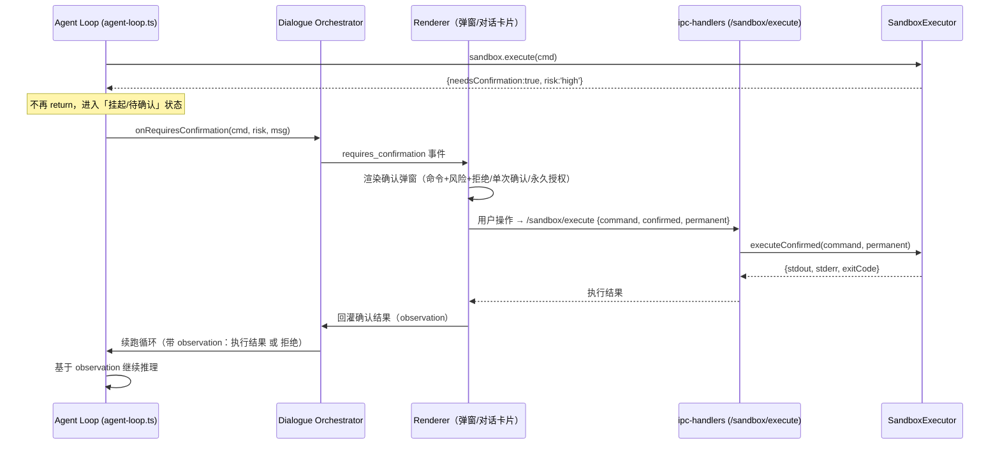

# P1/P2 安全加固 PRD —— OpenClaw Assistant

> 编制：产品经理（许清楚 / Xu）　|　对象：OpenClaw Assistant（Electron 42 + TypeScript 6 桌面端、离线优先 AI Agent）
> 范围：仅本次诊断报告中 **P1/P2 安全相关** 5 项（S5 / S6 / S7 / I4 / I6）。P0 红线（I2/I3、S1-S4、K1/K2、C1、M2）已修复，不在本 PRD 范围。
> 约束：**所有改动必须 in-place 改现有代码**，渲染层为原生 TypeScript + 自定义 ES Module（Hash 路由），**不得引入 React/Vue/MUI 等新框架或新页面架构**。

---

## 0. 项目信息

| 项 | 内容 |
|---|---|
| Language | 中文 |
| 技术栈 | Electron 42 + TypeScript 6；主进程 `src/main/`、后端 `src/backend/`、渲染层 `src/renderer/`（原生 TS + ES Module） |
| Project Name | `security_p1p2_hardening` |
| 原始需求复述 | 基于诊断报告，对 S5（确认回灌缺失）、S6（沙盒日志非防篡改）、S7（永久授权正则脆弱）、I4（innerHTML 未统一转义）、I6（console 同步写 + 明文敏感）五个安全项编写聚焦 PRD，输出可验收 AC、涉及文件线索、UI 稿（仅 S5）与待确认决策。 |
| 关键上下文 | P0 已修：S1/S2 风险分级与确认弹窗、S3 RBAC 网关、S4 自动化注入、I2/I3 鉴权与 CSP、K1/K2 代码落盘/SSRF、C1 凭证、M2 嵌入可用性、I7 claw:// 目录穿越。本次渲染层确认 UI（`components.ts:292-308`）与 IPC 回传通道（`/sandbox/execute` 已支持 `confirmed/permanent`）已具备，主要缺口在「确认结果回到 Agent 循环」的重入协议（S5）。 |

---

## 1. 产品目标

> **目标（一句话）**：在已修复 P0 安全红线的基础上，补齐「沙盒确认闭环、独立防篡改审计、精确化授权、统一 XSS 转义、日志敏感字段脱敏」五道纵深防御，使 OpenClaw Assistant 在 Agent 自主执行、权限授予与日志留存环节达到**可审计、不可绕过、不泄露敏感信息**的安全状态。

---

## 2. 用户故事

| 编号 | 视角 | 故事 |
|---|---|---|
| US-S5-1 | Agent（自主执行） | 作为 Agent，当我要执行一条 high 风险命令时，我希望先弹出确认、并把用户的「确认/拒绝」结果回灌进我的推理循环，这样我才能基于执行结果继续或调整策略，而不是卡死或被悄悄绕过。 |
| US-S5-2 | 普通用户 | 作为用户，当 Agent 要执行危险命令时，我希望能明确看到命令原文、风险等级，并选择「拒绝 / 单次确认 / 永久授权」，确认后 Agent 能基于结果继续对话。 |
| US-S6-1 | 安全管理员 | 作为安全管理员，我希望沙盒所有操作都写入一条**独立、不可篡改、带角色与来源**的审计日志，这样我能在合规审计时追溯「谁、在什么上下文、执行了什么」。 |
| US-S7-1 | 安全管理员 | 作为安全管理员，我希望永久授权按「规范化命令指纹」存储、可限定范围和到期，并能随时撤销，这样授权不会被正则元字符误匹配放大，也不会永久失控。 |
| US-S7-2 | 普通用户 | 作为用户，我希望我授予过的「永久允许」能在我反悔时一键撤销，且到点自动失效，而不是永不再次确认。 |
| US-I4-1 | 普通用户 | 作为用户，当我从磁盘加载自定义 Logo 或看到弹窗内容时，我希望这些内容即使含恶意脚本也不会被执行，避免 XSS 自注射。 |
| US-I6-1 | 安全管理员 | 作为安全管理员，我希望写入日志的命令、记忆、API Key 等敏感字段被脱敏，这样即使日志文件被读出也不会泄露凭据与隐私。 |

---

## 3. 需求池

> 优先级：🔴 P0（不在本范围）/ 🟠 P1（近期）/ 🟡 P2（规划）。安全目标对应诊断报告原文。

### 3.1 S5 —— 沙盒确认回灌机制缺失（P1, 🟠）

- **安全目标**：Agent 自主执行命令时，high/medium 风险命令必须经用户确认，且「确认/拒绝」结果必须回灌进 Agent 推理循环，使 Agent 能基于执行结果继续或调整，杜绝工具调用卡死或绕过确认。
- **可验收 AC**：
  1. Agent 模式下执行 high/medium 风险命令时，**必然**触发确认交互（阻塞模态弹窗或在对话流内嵌确认卡片，见待确认），且 `agent-loop` **不得**在 `needsConfirmation` 时直接 `return` 结束，必须进入「挂起 / 待确认」状态等待结果。
  2. **用户拒绝** → 命令**不执行**；拒绝结果作为 observation（如 `用户拒绝了命令 X 的执行（风险：high）`）回灌 `agent-loop`，Agent 据此调整策略或向用户说明，循环可继续或正常终止。
  3. **用户单次确认** → 命令执行；`stdout/stderr/exitCode` 作为 observation 回灌 `agent-loop` **续跑**（而非从零重跑对话），且对同一命令**不重复**触发确认。
  4. **用户选择「永久授权」** → 该命令的规范化指纹写入授权白名单，后续同指纹命令免确认直接执行（但仍受 `forbidden` 阻断，纵深防御）。
  5. **确认超时**（可配置，建议默认 5 分钟）→ 视为拒绝，回灌拒绝结果，不阻塞对话。
  6. **非 Agent 路径回归**：用户在沙盒面板手动点执行 / 普通对话中请求执行的既有确认交互保持原样，不引入回归。
  7. **自动化测试**：构造一个 high 风险命令的 Agent 任务，断言 (a) 触发确认；(b) 拒绝后无执行且 Agent 输出提及「被拒/未执行」；(c) 确认后 stdout 出现在后续 observation 中。
- **涉及文件 / 线索（基于源码事实）**：
  - `src/backend/sandbox.ts:199-209` — `execute()` 对 high/medium 返回 `needsConfirmation:true`（确认网关已存在）。
  - `src/backend/agent-loop.ts:127-135` — `if (execResult.needsConfirmation) { onRequiresConfirmation(...); return finalMergedResponse; }` ← **闭环断裂点**：return 后确认结果无法回到循环。
  - `src/backend/dialogue-orchestrator.ts:131-133` — `onRequiresConfirmation` 向渲染层发 `requires_confirmation` 消息（通道已存在）。
  - `src/main/ipc-handlers.ts:1273-1279` — `/sandbox/execute` 已支持 `confirmed/permanent` 参数并调用 `executeConfirmed`（回传通道已存在）。
  - `src/renderer/components.ts:292-308` — 已有确认弹窗（用 `escapeHtml` 渲染命令），可作为 UI 基础。

### 3.2 S6 —— 沙盒日志非防篡改、无独立审计（P2, 🟡）

- **安全目标**：沙盒操作产生独立、append-only、防篡改（哈希链）、含角色/来源的独立审计日志，与业务日志、控制台日志分离，满足合规审计。
- **可验收 AC**：
  1. 新增**独立审计日志文件**（建议 `sandbox-audit.jsonl`），与现有 `sandbox-logs.json`（业务日志）及 `openclaw.log`（控制台）**物理分离、分开写入**。
  2. 每条审计记录字段至少含：`timestamp`、`command`（必要时随 I6 脱敏）、`riskLevel`、`action(allowed|blocked|auto-allowed)`、`result`、`actor`（角色：user/admin/agent）、`source`（来源：agent-loop / sandbox-panel / ipc）、`recordHash`、`prevHash`。
  3. **append-only**：仅追加，不支持就地编辑/删除单条；提供「清空全部」需显式二次确认并记为一条 admin 操作。
  4. **防篡改**：每条记录写入时计算 `SHA-256(prevHash + canonicalJSON(record))` 作为 `recordHash`，首条 `prevHash` 为固定种子；提供校验工具 / 启动自检，哈希链断裂即告警（写日志 + 控制台）。
  5. **读受保护**：审计日志读取接口受 RBAC（P0 已修复的 S3）保护，非授权角色不可读。
  6. **自动化测试**：写入 N 条记录断言哈希链连续；篡改中间一条后校验必须失败。
- **涉及文件 / 线索**：
  - `src/backend/sandbox.ts:127-144` — `_logOperation` 写入 `this.logs` 内存数组再整体覆盖写。
  - `src/backend/sandbox.ts:60` — `logsPath = .../sandbox-logs.json`（明文、非 append-only、无哈希、无角色/来源）。
  - `src/backend/sandbox.ts:112-121` — `_saveLogs` 整体 `writeFileSync` 重写（非追加、可被篡改）。
  - `src/backend/sandbox.ts:468-475` — `getLogs` 分页读取（改造为审计读接口）。

### 3.3 S7 —— 永久授权按正则原文、匹配脆弱（P2, 🟡）

- **安全目标**：永久授权改为按「规范化命令指纹」存储，支持范围限定（前缀/白名单）、撤销与到期；消除正则元字符误匹配 / 回退 `includes` 的脆弱性。
- **可验收 AC**：
  1. 授权存储由「命令原文作正则 `pattern`」改为「**规范化命令指纹**」：对命令做归一化（去首尾空白、折叠连续空白、展开常见变量如 `$HOME/$USER/~`、去除易变参数如时间戳/随机串——具体规则见待确认）后生成指纹串存储。
  2. `isAuthorized` 改为基于指纹的**精确 / 前缀匹配**（不再 `new RegExp(perm.pattern)`），对含正则元字符（`.*()[]+?` 等）命令不再误匹配、不再因正则构造失败回退 `includes`。
  3. 授权支持**范围限定**：可指定适用 `riskLevel`（如仅 low，或 low+medium）与作用域（如仅特定 `cwd`/项目），默认最小范围。
  4. **撤销**：`revokePermission(id)` 保留并可用；UI/API 可列出并撤销单条授权。
  5. **到期**：授权可带 `expiresAt`；`isAuthorized` / 执行前置检查到期即作废，过期授权在 `getPermissions` 中标灰/过滤。
  6. **迁移**：启动时对既有 `sandbox-permissions.json` 中旧正则 `pattern` 做一次性规范化迁移；无法规范化的标记为失效待用户确认。
  7. **自动化测试**：对含 `.*`/`(` 等元字符的命令授予后，`isAuthorized` 仅匹配预期命令而非误匹配任意含该串的命令；过期授权返回未授权。
- **涉及文件 / 线索**：
  - `src/backend/sandbox.ts:434-444` — `grantPermission(pattern, permanent)` 存命令原文为 `pattern`。
  - `src/backend/sandbox.ts:161-174` — `isAuthorized` 用 `new RegExp(perm.pattern, 'i')` 且 `catch` 回退 `command.includes(perm.pattern)`（脆弱点）。
  - `src/backend/sandbox.ts:10-15` — `Permission` 接口仅含 `id/pattern/permanent/grantedAt`，**缺范围与到期字段**。
  - `src/backend/sandbox.ts:238-240` — `executeConfirmed` 调 `grantPermission(command, true)` 把原文当指纹。

### 3.4 I4 —— 部分 innerHTML 未统一转义（P2, 🟡）

- **安全目标**：所有磁盘 / 用户数据经 `innerHTML` 注入前统一转义，消除 XSS 自注射面（在 I2/I3 已修复前提下纵深防御）。
- **可验收 AC**：
  1. 提供 / 统一**单一转义工具**（`src/renderer/utils.ts:154` 已有 `escapeHtml` 作为统一入口），所有 `innerHTML` 注入点一律先 escape 再拼接，或改用 `textContent` / 安全 DOM API。
  2. 至少覆盖以下未转义点（来自诊断报告，部分文件「待核实」）：
     - `src/renderer/app.ts:235 / :294` — 注入 `savedLogo` / `dataUrl` 到 ``（磁盘数据）。
     - `src/renderer/components.ts:60` — `body.innerHTML = content`（弹窗 body，直接注入未转义）。
     - `src/renderer/chat.ts:1465` — `userBox` 注入用户消息（待核实）。
     - `src/renderer/market.ts:295 / :535` — 注入自定义 logo（磁盘数据，待核实）。
  3. 对 **URL 型注入**（如 logo ``）除 `escapeHtml` 外增加协议 / 来源校验（仅允许 `data:` / `https?://` 或本地已信任路径），禁止 `javascript:` 等。
  4. 主对话 `parseMarkdown` 已有转义（`utils.ts:223-246`），本次**不改变其语义**，仅确保其他路径对齐。
  5. **静态 / 回归测试**：对注入点喂入 `` 与 `javascript:alert(1)` 类 payload，断言渲染后**不产生可执行脚本节点**（DOM 中无 script 执行、img `onerror` 不触发）。
- **涉及文件 / 线索**：
  - `src/renderer/utils.ts:154` — `escapeHtml`（已有，作为统一入口）。
  - `src/renderer/app.ts:235/294`、`src/renderer/components.ts:60`、`src/renderer/chat.ts:1465`、`src/renderer/market.ts:295/535`（详见诊断报告 IPC 第 6 章 I4；`app/components/chat/market` 部分为「待核实」文件）。
  - 前置：I3 已收紧 CSP（`main.ts` 移除 `bypassCSP`）。

### 3.5 I6 —— console 重定向同步写 + 明文敏感（P1, 🟠）

- **安全目标**：对写入 `openclaw.log` 的敏感字段（命令原文、记忆文本、API Key、文件路径等）做**脱敏**，降低日志泄露风险；性能 / 异步化列为建议项（**非本次验收重点**）。
- **可验收 AC**：
  1. 在 `console.log/error` 重定向入口（`main.ts:492-499`）对落入日志的字符串做敏感字段脱敏：识别并遮罩 **API Key**（`sk-...`、`AKIA...`、OpenAI/Anthropic 等）、**记忆 / 对话正文**、**命令原文**、**文件路径**中的敏感片段。
  2. 提供**可配置脱敏策略**（全遮 / 部分保留前后几位 / 哈希），至少支持：密钥类仅留前缀 4 位其余 `***`；命令 / 记忆类按长度部分遮（如仅保留前 16 字符 + `***`），敏感字段不落明文。
  3. 脱敏**仅作用于落盘内容**，不影响原始 `console` 输出到终端调试。
  4. 覆盖现有已在沙盒 / 记忆路径打印敏感内容的调用点：如 `sandbox.ts:274` `console.log` 打印命令原文 `[沙盒安全中转]...执行: "${command}"`；`sandbox.ts:361` `console.warn` 打印降级命令（与 I6 协同脱敏）。
  5. **单元测试**：用含 `sk-xxxx` 与命令的样例输入，断言 `openclaw.log` 落盘内容中**无完整明文密钥 / 命令**。
  6. **建议项（非验收）**：将 `appendFileSync` 改为异步写（pino/winston 或自写异步队列）+ 日志级别 + 轮转；列入 PRD 作为后续迭代建议，本次不强制。
- **涉及文件 / 线索**：
  - `src/main/main.ts:488-499` — `console.log/error` 重定向为 `fs.appendFileSync` 每行（同步、无脱敏）。
  - `src/backend/sandbox.ts:274 / :361` — 打印命令原文到 `console`（明文，需随 I6 脱敏）。
  - 前置：I3 CSP 已收紧。

---

## 4. UI 设计稿

> 仅 **S5** 需要独立 UI（确认弹窗 / 对话流确认卡片）。S6 / S7 / I4 / I6 为**非 UI 或极简 UI**，统一注明「无独立 UI」。

### 4.1 S5 —— 确认回灌交互流（Mermaid 时序图）



### 4.2 S5 —— 确认弹窗线框（ASCII）

```
┌───────────────────────────────────────────────┐
│  ⚠️ 需要确认：高风险命令执行            [高风险] │
├───────────────────────────────────────────────┤
│  命令：                                        │
│  ┌─────────────────────────────────────────┐  │
│  │ rm -rf /path/to/dir   (等宽字体展示)     │  │
│  └─────────────────────────────────────────┘  │
│  此操作可能导致系统损坏或数据丢失，请谨慎确认。│
│                                               │
│  ☑ 记住此命令（永久授权，可撤销/到期）         │
│                                               │
│        [ 拒绝 ]      [ 确认执行 ]              │
└───────────────────────────────────────────────┘
   拒绝 → 命令不执行，结果回灌 Agent（调整策略）
   确认 → 命令执行，stdout/stderr 回灌 Agent 续跑
```

> 弹窗渲染命令须用 `escapeHtml`（现有 `components.ts:308` 已遵循），避免命令内容自身触发 XSS。

### 4.3 其他项 UI 说明

| 项 | UI 说明 |
|---|---|
| S6 | 无独立 UI；仅新增审计日志文件与读接口（可复用现有沙盒日志查看面板展示审计 tab，非强制）。 |
| S7 | 无独立 UI；复用现有 `/sandbox/permissions` 列表，增加「范围 / 到期 / 撤销」列与操作（后端接口增强）。 |
| I4 | 无独立 UI；纯代码重构（统一转义入口 + 改造注入点），无新增页面。 |
| I6 | 无独立 UI；纯代码重构（脱敏函数 + 重定向入口接入），可选配置项。 |

---

## 5. 待确认问题（需架构师 / 用户拍板的设计决策）

> 以下为影响实现方案的关键决策，需在开发前由架构师（高见远）与用户拍板。PRD 仅提需求，不替架构师做设计。

### S5 —— 确认回灌机制（最关键）
- **交互形态**：Agent 模式确认是「**阻塞式模态弹窗**」（现有 `components.ts` 弹窗）还是「**在对话流内嵌确认卡片 + 等待用户回复**」？前者实现简单但打断体验，后者更契合 Agent 对话流。
- **挂起 vs 重跑**：`agent-loop` 在待确认时是「**挂起当前循环上下文、等结果回来续跑**」还是「**记录待确认状态、用户确认后作为新观测重入**」？需明确不重复消费历史消息、不重复触发同一命令确认。
- **永久授权与单次确认共存**：用户在同一弹窗勾选「记住此命令」时，一次性确认与永久授权如何并存？永久授权指纹的生成规则是否与 S7 的指纹一致（建议复用，避免两套规范）？

### S6 —— 审计日志
- **哈希链强度**：SHA-256 串联前条记录哈希（推荐，够用）即可，还是需要**数字签名**（密钥管理成本更高）？
- **存放路径与命名**：审计日志放在 `dataDir/sandbox-audit.jsonl` 还是独立 `audit/` 目录？是否与业务日志同目录？
- **脱敏协同**：审计日志中的 `command` 字段是否随 I6 一并脱敏？合规通常要求「原文留痕」，需用户确认审计是否允许脱敏或明文（明文则存储权限需收紧）。

### S7 —— 授权指纹与范围
- **归一化规则**：「规范化命令指纹」如何归一化（去空白 / 展开 `$HOME~` / 去除易变参数如时间戳随机串）？规则过宽会弱化安全，过窄会频繁重复确认。
- **范围限定方式**：按「**前缀匹配**」还是「**正则白名单**」（正则又回到脆弱性，建议前缀 + 显式白名单）？是否区分 `riskLevel` 与 `cwd` 作用域？
- **到期默认值**：永久授权是否真「永久」？建议引入默认到期（如 30 天）或显式「永不过期」开关。

### I6 —— 脱敏策略（次关键）
- **敏感字段清单**：哪些算敏感（命令原文、记忆文本、API Key、文件路径、对话正文）？是否含 Agent 中间推理？
- **脱敏策略**：全遮 / 部分保留前后几位 / 哈希？密钥类建议「仅前缀 + `***`」，命令类建议「部分遮 + 标记」。
- **性能权衡**：本次仅做脱敏（同步即可），异步化 / 轮转列为建议项——是否接受本次主线程仍同步写（仅内容脱敏）？

### I4 —— 转义实现
- **自写 vs 引入库**：渲染层为原生 TS + ES Module，能否引入轻量净化依赖（如 DOMPurify 的适配）？还是**自写 `escapeHtml` 统一入口**（现有 `utils.ts:154` 已具备，推荐复用）？引入依赖需评估离线打包体积。
- **URL 型注入校验**：`` 类注入除转义外是否需要独立协议白名单校验（防 `javascript:`）。

---

## 6. 验收总览（一表速览）

| 编号 | 优先级 | 安全目标一句话 | 核心 AC（摘要） |
|---|---|---|---|
| S5 | 🟠 P1 | 确认结果必须回灌 Agent 循环 | high/medium 必确认；拒绝不执行且回灌；确认后续跑；永久授权免确认；超时视为拒绝；非 Agent 路径不回归 |
| S6 | 🟡 P2 | 独立防篡改审计日志 | 独立 `sandbox-audit.jsonl`；append-only + SHA-256 哈希链；含 actor/source；读受 RBAC 保护；篡改可检 |
| S7 | 🟡 P2 | 授权按指纹、可限定/撤销/到期 | 规范化指纹存储；isAuthorized 不再正则误匹配；范围 + 到期；可撤销；旧数据迁移 |
| I4 | 🟡 P2 | 统一转义消除 XSS | 统一 `escapeHtml` 入口；覆盖 app/components/chat/market 注入点；URL 型加协议校验；payload 测试不执行 |
| I6 | 🟠 P1 | 日志敏感字段脱敏 | `console` 落盘脱敏 API Key/命令/记忆/路径；仅落盘脱敏不影响终端；单测无明文密钥；异步化列为建议 |

---

> 备注：本 PRD 仅描述「做什么 / 验收标准 / 待确认决策」，不包含架构设计与代码实现（由架构师高见远负责）。
