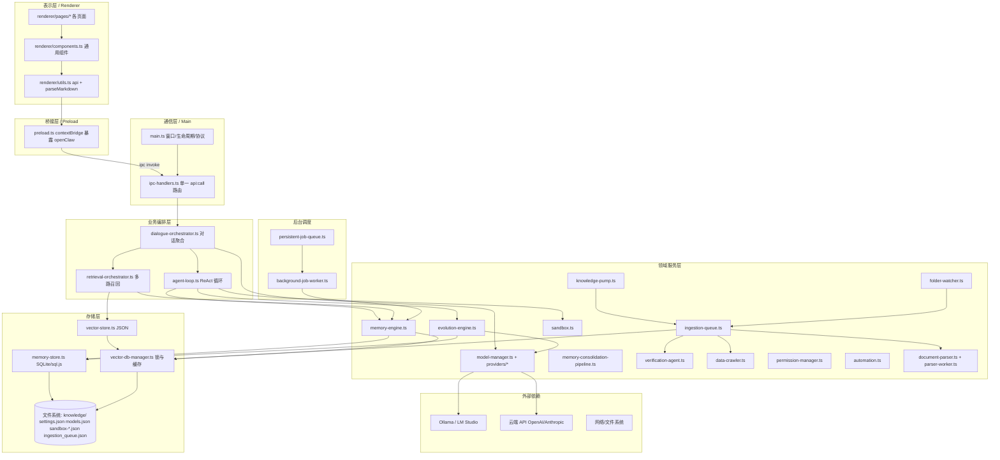
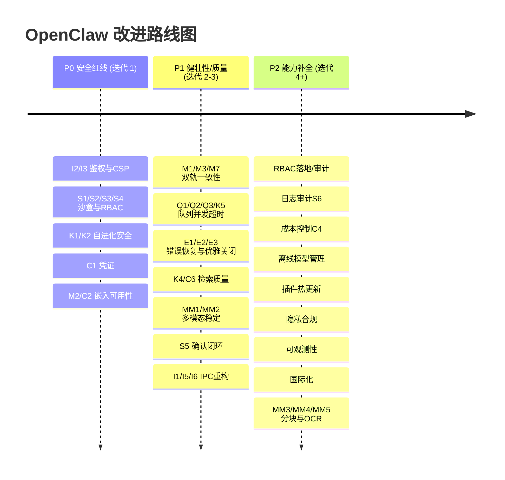

# 文档三：OpenClaw Assistant 软件架构文档

> 编制：软件架构师（高见远 / Gao）　|　对象：OpenClaw Assistant（Electron 42 + TypeScript 6 桌面端离线优先 AI Agent）
> 配套文档：《文档二：现有问题诊断报告》（以下简称「文档二」）。本文件中的「痛点编号」M* / K* / S* / C* / MM* / I* / Q* / E* 均指向文档二。
> 说明：架构描述基于实际阅读 `src/` 下 33 个源文件；结论可追溯到具体文件/函数。未读文件相关点为「待核实」。

---

## 1. 系统定位与分层总览

OpenClaw Assistant 是一个**桌面端、离线优先的 AI Agent 软件**：前端（Renderer）经 `contextBridge` 暴露的 `window.openClaw` 调用主进程；主进程通过单一 `api:call` IPC 路由分发到各后端领域服务；后端领域服务再调用本地推理引擎（Ollama / LM Studio）、云端 API、文件系统与网络。

### 1.1 分层架构图（Mermaid）

### 1.2 分层职责说明

| 层 | 职责 | 关键文件 |
|---|---|---|
| 表示层 | 页面渲染、用户输入、流式展示 | `renderer/pages/*`、`renderer/components.ts` |
| 桥接层 | 经 `contextIsolation` 安全暴露原生 API，杜绝 `nodeIntegration` | `preload.ts` |
| 通信层 | 注册 IPC、窗口生命周期、自定义 `claw://` 协议、日志重定向 | `main.ts`、`ipc-handlers.ts` |
| 业务编排 | 对话上下文聚合、Agent ReAct 循环、多路召回编排 | `dialogue-orchestrator.ts`、`agent-loop.ts`、`retrieval-orchestrator.ts` |
| 领域服务 | 模型/记忆/知识/沙盒/自动化/多模态等内聚能力 | `model-manager`、`memory-engine`、`ingestion-queue`、`sandbox` 等 |
| 存储层 | SQLite 元数据 + JSON 向量库 + 配置/队列文件 | `memory-store`、`vector-store`、`vector-db-manager` |
| 后台调度 | 持久化作业队列与轮询 worker | `persistent-job-queue`、`background-job-worker` |
| 外部依赖 | 本地推理引擎、云端 API、网络/文件系统 | Ollama/LM Studio/云 API |

---

## 2. 模块职责、对外接口与内部依赖

> 标注说明：● 表示强依赖；○ 表示弱/可选依赖。

### 2.1 通信层

#### `main.ts`
- **职责**：创建主窗口/悬浮球、注册 `claw://` 协议、单例锁、全局截图快捷键、重定向日志、初始化并装配所有后端实例、启动后台 worker/知识泵/文件夹监控。
- **对外接口（IPC）**：`system:getApiToken`（sync）、`system:getInfo`、`system:openExternal`、`system:selectFile`、`system:selectDirectory`、`window:*`、`app:restart`、`system:getScreenCapture`、`system:captureScreenArea`、`quick-prompt:send`。
- **对外接口（协议）**：`claw://app/...` → `net.fetch('file://'+path)`。
- **内部依赖**：装配 `ModelManager`/`MemoryStore`/`SandboxExecutor`/`PermissionManager`/`AutomationController`/`PersistentJobQueue`/`BackgroundJobWorker`/`IngestionQueueManager`/`KnowledgePump`/`FolderWatcherManager` → `registerApiIpc(...)`。
- **痛点**：I5（全局 AbortController）、I6（同步日志）、E2（无优雅关闭）、I3（bypassCSP）。

#### `ipc-handlers.ts`
- **职责**：唯一 `api:call` REST 风格路由（URL+method+body）分发所有业务请求；独立的 `api:chat:stream` / `api:chat:abort` 流式对话通道。
- **对外接口（IPC 通道）**：`api:call`、`api:chat:stream`、`api:chat:abort`；下游事件：`api:chat:chunk`、`api:core-manager:log`。
- **典型业务路由（节选）**：`/chat/*`、`/memory/*`、`/knowledge/*`、`/models/*`、`/sandbox/*`、`/skills`、`/plugins`、`/settings`、`/permissions`、`/core-manager/*`、`/automation/screenshot`、`/system/*`。
- **内部依赖**：所有后端服务（经 `dependencies` 注入）。
- **痛点**：I1（巨型路由 + `/memory` 重复定义）、I2（无 token 校验）、S3（RBAC 未作为网关）。

#### `preload.ts`
- **职责**：`contextBridge.exposeInMainWorld('openClaw', {...})`，暴露 `apiToken`、`apiCall`、`apiCallStream`、`abortStream`、`onChatChunk`、`system.*` 等。
- **痛点**：I2（`apiToken` 暴露但主进程不校验）、I4（部分渲染 `innerHTML` 未转义，主对话已转义）。

### 2.2 业务编排层

#### `dialogue-orchestrator.ts`（类 `ContextAggregator`）
- **职责**：接收原始对话意图 → 建/补会话 → 历史滑窗压缩 → 多路 RAG 融合检索 → 组装超级 Prompt → 驱动 `AgentLoop` → 收尾清洗 + 异步记忆抽取。
- **对外接口（函数）**：`executeChatStream(payload, signal)`；依赖注入：`{modelManager, memoryStore, sandbox, dataDir, mainWindowRef, jobQueue}`。
- **对外事件**：`api:chat:chunk`（type: conversation/chunk/requires_confirmation/done/error）。
- **内部依赖**：● `MemoryEngine`、● `AgentLoop`、● `RetrievalOrchestrator`、● `EvolutionEngine`、○ `PersistentJobQueue`。
- **痛点**：每次调用 new 实例（轻量但频繁）；确认闭环依赖 S5。

#### `agent-loop.ts`（类 `AgentLoop`）
- **职责**：ReAct 循环，拦截 `<execute>` 与 Hermes JSON 工具调用 → 沙盒执行 / 文件读取 → 观察回灌 → 多轮推理；`maxRecursion=3`。
- **对外接口（函数）**：`run(context): Promise<string>`；依赖：`{modelManager, sandbox, memoryStore, evolutionEngine, onChunk, onRequiresConfirmation}`。
- **内部依赖**：● `sandbox.execute`、● `modelManager.chatStream`、● `evolutionEngine.evolve`（失败末轮）。
- **痛点**：S5（确认即 return，无重入）、工具解析脆弱（正则）、上下文截断粗略（字符级）。

#### `retrieval-orchestrator.ts`（类 `RetrievalOrchestrator`）
- **职责**：三路并发召回（记忆/知识库/历史对话/实体图谱）+ 字符预算滑动分配，组装增强 System Prompt。
- **对外接口（函数）**：`retrieveAndOrchestrate(query, convId, maxChars=15000)`。
- **内部依赖**：● `MemoryEngine.unifiedRetrieval`、● `ragEngine.searchRelevant`（内存库）。
- **痛点**：K4（两套知识源合并）、预算为字符级非 token 级。

### 2.3 领域服务层

#### `model-manager.ts`（类 `ModelManager`）+ `providers/*`
- **职责**：统一模型配置、云端/本地模型调度、嵌入（embedding）、重排（rerank，桩）、双脑路由、第三方引擎探测与同步。
- **对外接口（函数）**：`chat`、`chatStream`、`getEmbedding`、`getRerankScore`、`listModels`、`getActiveModel`、`setActiveModel`、`addModel`、`removeModel`、`syncThirdPartyLocalModels`、`detectLocal`、`proxyFetchModels`/`proxyTest`。
- **对外接口（IPC 路由）**：`/models`、`/models/active`、`/models/sync`、`/models/local-detect`、`/models/ollama/list`、`/models/lmstudio/list`、`/models/proxy-*`。
- **内部依赖**：● `ProviderFactory` → `Ollama/OpenAI/AnthropicProvider`、● `electron.safeStorage`（加密）。
- **痛点**：C1（密钥硬编码）、C2/M2（随机嵌入兜底）、C3（双脑误分流）、C6（重排桩）、C7（base64 全量入上下文）。

#### `memory-engine.ts`（类 `MemoryEngine`）
- **职责**：双轨记忆提取（Tool Call / 正则）、LLM 冲突合并、实体三元组抽取、情景摘要、统一检索融合（含艾宾浩斯遗忘曲线）。
- **对外接口（函数）**：`supportsToolCall`、`getMemoryTools`、`extractMemoriesFromRegex`、`reconcileAndStore`、`extractAndStoreEntities`、`generateEpisodeSummary`、`unifiedRetrieval`、`processMemoryExtractionAsync`。
- **内部依赖**：● `modelManager.getEmbedding`、● `memoryStore`、● `vectorDbManager`。
- **痛点**：M1（向量失同步）、M2（随机嵌入）、M3（检索写库）、M4（解析失败兜底）。

#### `memory-consolidation-pipeline.ts`
- **职责**：周期性将同分类记忆送 LLM 消重/仲裁并更新/删除。
- **对外接口（函数）**：`consolidate()`。
- **内部依赖**：● `modelManager`、`memoryStore`。
- **痛点**：M5（无长度上限 + 删向量不同步）、M1。

#### `ingestion-queue.ts`（类 `IngestionQueueManager`）
- **职责**：知识提炼队列——爬取/读文 → 切分 → 暂存区 → 核验（VerificationAgent）→ 晋升正式库 / 隔离；物理归档源文件。
- **对外接口（函数）**：`addTask`、`pause`/`resume`、`getQueueInfo`、`clearHistory`、`processLoop`、`archivePhysicalFile`。
- **对外接口（IPC 路由）**：`/knowledge/add`、`/knowledge/ingest-url`、`/knowledge/queue*`、`/knowledge/staging/action`、`/knowledge/files*`、`/knowledge/import` 等。
- **内部依赖**：● `DataCrawler`、● `DocumentParser`、● `VerificationAgent`、● `vectorDbManager`、● `modelManager.getEmbedding`。
- **痛点**：K3（核验失败 FAIL）、K5（串行无超时）、Q3/Q4（失败不重试、processing 卡死）。

#### `knowledge-pump.ts` / `folder-watcher.ts`
- **职责**：`KnowledgePump` 定时把 `settings.crawlingSources` 推入队列；`FolderWatcherManager` 用 chokidar 监控目录增量，自动提炼入库。
- **对外接口（IPC 路由）**：`/knowledge/sources`、`/knowledge/watched-folders`。
- **痛点**：K2（SSRF）、K6（默认爬网）、MM2（大文件主线程解析）。

#### `evolution-engine.ts`
- **职责**：失败反思 → 让 LLM 生成修复 TS 脚本并落盘 `.agents/skills/`，写一条系统记忆。
- **痛点**：K1（LLM 生成代码落盘，潜在 RCE，当前死代码）。

#### `verification-agent.ts` / `data-crawler.ts`
- **职责**：`VerificationAgent` 对文本做谣言/广告研判（JSON）；`DataCrawler` cheerio 抓网页正文。
- **痛点**：K3（失败即 FAIL）、K2（SSRF）。

#### `sandbox.ts` / `permission-manager.ts` / `automation.ts`
- **职责**：`SandboxExecutor` 风险分级 + Docker/宿主机执行 + 权限/日志；`PermissionManager` RBAC 配置（admin/user/guest）；`AutomationController` 键鼠/窗口/截屏/文件。
- **对外接口（IPC 路由）**：`/sandbox/execute`、`/sandbox/permissions`、`/sandbox/logs`、`/permissions`、`/automation/screenshot`。
- **痛点**：S1~S7（见文档二第 3 节）。

#### `document-parser.ts` / `parser-worker.ts`
- **职责**：父子分块（字符级）、流式读取、worker 线程多模态解析（tesseract OCR / pdfjs）。
- **痛点**：MM1~MM5（见文档二第 5 节）。

### 2.4 存储层

#### `memory-store.ts`（类 `MemoryStore`，sql.js）
- **职责**：记忆/对话/实体/情景/后台作业 的 SQLite 持久化；原子 `.tmp+rename` 落盘 + 500ms 防抖。
- **痛点**：M3/M7（防抖丢写、整库 export）、E1。

#### `vector-store.ts` + `vector-db-manager.ts`
- **职责**：`VectorStore` 内存向量 + 余弦/BM25 混合检索 + 原子写；`VectorDatabaseManager` 单例缓存 + 每文件 Promise 互斥锁（读写串行）。
- **痛点**：O(N) 扫描 + 每次全文件重写（可扩展性）；缓存无上限；维度不匹配无校验（与 M2 叠加）。

---

## 3. 模块级痛点映射（落到模块）

| 模块 | 关联痛点（文档二编号） | 一句话痛点 |
|---|---|---|
| `ipc-handlers.ts` | I1, I2, S3 | 路由巨型且 `/memory` 重复定义；无鉴权；RBAC 未生效 |
| `main.ts` | I3, I5, I6, E2 | bypassCSP；全局 AbortController；同步日志；无优雅关闭 |
| `model-manager.ts` | C1, C2, C3, C6, C7 | 密钥硬编码；随机嵌入；双脑误分流；重排桩；base64 全量入上下文 |
| `memory-engine.ts` | M1, M2, M3, M4 | 向量失同步；随机嵌入；检索写库；解析失败兜底 |
| `memory-store.ts` | M3, M7, E1 | 防抖丢写；整库 export；落盘策略不统一 |
| `memory-consolidation-pipeline.ts` | M1, M5 | 删向量不同步；整分类无上限 |
| `agent-loop.ts` | S5 | 确认即 return，无重入闭环 |
| `sandbox.ts` | S1, S2, S6, S7 | 正则绕过；宿主机继承密钥；日志非审计；权限正则脆弱 |
| `permission-manager.ts` | S3 | RBAC 从不作为网关 |
| `automation.ts` | S4 | PowerShell 注入 |
| `evolution-engine.ts` | K1 | LLM 代码落盘（潜在 RCE） |
| `data-crawler.ts` | K2 | 无 SSRF 防护 |
| `verification-agent.ts` | K3 | 失败即 FAIL |
| `ingestion-queue.ts` | K3, K5, Q3, Q4 | 串行无超时；失败不重试；processing 卡死 |
| `knowledge-pump.ts` | K2, K6 | 静默爬网 |
| `document-parser.ts` | MM1~MM5 | 离线 OCR 不符；主线程全量；字符分块；worker 无池 |
| `background-job-worker.ts` | Q2 | 串行无超时 |
| `vector-store.ts` | 可扩展性 | O(N) 扫描 + 全文件重写 |

---

## 4. 下一步改进方向与优先级排序

### 4.1 路线图（时间线）

### 4.2 优先级明细表

| 优先级 | 目标 | 关键举措 | 关联痛点 |
|---|---|---|---|
| **P0** | 关闭安全红线 | ① `api:call` 入口鉴权 + 收紧 CSP；② 沙盒改用命令解析+解释器载体一律确认，无 Docker 时低权/清 env 或禁高危；③ RBAC 作为网关强制；④ 自动化参数化+默认关；⑤ 爬取 SSRF 拦截+知识泵默认关；⑥ 移除/隔离 evolution 自动落盘代码；⑦ API Key 改为每机派生密钥；⑧ 嵌入不可用 fail-fast+内置离线嵌入 | I2,I3,S1~S4,K1,K2,C1,M2,C2 |
| **P1** | 一致性/健壮性/质量 | ① 记忆「向量+元数据」事务一致；② 双轨队列合并为有界并发+超时+退避；③ 优雅关闭与崩溃恢复覆盖 ingestion processing；④ 统一落盘策略（关键写原子）；⑤ 检索合并为单一持久化服务（去 `rag-engine` 内存库）；⑥ 接入真实 reranker 或下线权重；⑦ 多模态 worker 流式+大小上限+内置离线 OCR；⑧ Agent 确认重入闭环；⑨ `api:call` 拆分为模块 handler；⑩ 日志异步化+轮转 | M1,M3,M5,M7,Q1~Q4,E1~E3,K4,C6,MM1,MM2,S5,I1,I5,I6 |
| **P2** | 能力补全 | 见第 5 节遗漏功能点逐项落地 | C4,MM3~MM5,S6,I4,I7 |

---

## 5. 项目可能遗漏的功能点与必要性

> 以下为文档二未覆盖、但生产级桌面 AI Agent 应具备而当前代码**缺失或仅占位**的能力。每条给出必要性与建议落地形态。

| # | 功能点 | 当前状态 | 必要性 | 建议落地 |
|---|---|---|---|---|
| F1 | **RBAC 强制鉴权** | `permission-manager` 已定义但**未作为 IPC 网关**（S3） | 🔴 高 | 在 `api:call` 入口做 `checkPermission(resource, action)` 中间件；默认最小权限；与 I2 鉴权联动 |
| F2 | **日志审计** | `sandbox-logs.json` 明文非防篡改（S6）；无统一审计 | 🔴 高 | 独立 append-only 审计日志（含角色/来源/哈希链）；敏感操作留痕；满足合规 |
| F3 | **错误恢复 / 熔断机制** | 队列无超时、失败不重试、processing 卡死（Q3/Q4/E3）；无熔断 | 🔴 高 | 单任务超时 + 指数退避；外部 API 熔断（基于 Providers 已有 429 重试扩展为熔断器）；崩溃恢复覆盖全部队列 |
| F4 | **插件热更新** | 插件仅 JSON 元数据 + `status` 开关，无运行时代码加载/卸载 | 🟠 中 | 定义插件沙箱契约（预编译/隔离加载）、版本化、热加载/卸载与回滚 |
| F5 | **离线模型管理（下载/版本/量化）** | `registry.MODEL_MARKETPLACE` 为静态列表；`/models/pull` 等路由在 `utils.ts` 声明但主进程 `ipc-handlers` 未实现（待核实） | 🔴 高（离线优先核心） | 模型下载进度、版本管理、量化档位选择、本地缓存与清理；对接 Ollama/LM Studio 拉取 |
| F6 | **成本控制与用量统计** | 无 token 计数/用量（C4） | 🔴 高 | 按模型/会话/分类统计 token 与花费；预算上限与告警；用量面板 |
| F7 | **隐私合规（GDPR / 数据本地化）** | 无隐私声明、数据导出擦除、同意管理；日志可能含敏感明文（I6） | 🟠 中 | 数据地理位置策略、用户数据导出/删除（已有导出导入雏形）、敏感字段脱敏、隐私政策 |
| F8 | **可观测性（监控/告警）** | 仅 `console.log` 重定向（I6）；无指标/告警 | 🔴 高 | 结构化日志 + 指标（队列积压、嵌入失败率、API 错误率）+ 前端健康面板 + 异常告警 |
| F9 | **配置管理** | `settings.json`/`global-config.json` 散落读写，无 schema 校验/迁移 | 🟠 中 | 集中配置服务 + schema 校验 + 版本迁移 + 默认值；避免字段随意新增 |
| F10 | **国际化（i18n）** | 全中文硬编码 UI 文案 | 🟡 低 | i18n 框架（文案抽取 + 多语言包 + 运行时切换） |
| F11 | **安全渲染加固** | 主对话已转义（I4 已防护），但其余 `innerHTML` 未统一 | 🟠 中 | 全量 `innerHTML` → 安全 DOM / 统一 `escapeHtml`；用户/磁盘数据强制转义 |
| F12 | **凭证保险库** | API Key 加密 fallback 硬编码（C1） | 🔴 高 | 系统密钥链（keychain/keyring）+ 每机派生密钥；统一 Secrets Manager |
| F13 | **检索可观测与评估** | 无召回质量评估、无重排真实能力（C6/K4） | 🟠 中 | 离线评估集 + 召回率/命中率指标；真实 reranker 接入与 A/B |

---

## 6. 关键架构决策建议（Architecture Decision Records 摘要）

| ADR | 现状 | 建议决策 | 理由 |
|---|---|---|---|
| ADR-1 存储一致性 | SQLite 元数据 + JSON 向量库双轨，易失同步 | 引入「写入事务」：记忆增删改同步更新向量；后台孤儿 GC | 根治 M1/M3 类一致性问题 |
| ADR-2 嵌入可用性 | 缺失返回随机向量 | 内置可离线嵌入模型 + 健康探测 + fail-fast | 决定 RAG 是否可信（M2/C2） |
| ADR-3 沙盒模型 | 正则分级 + 宿主机降级继承 env | 命令解析 + 解释器载体确认 + 无 Docker 低权/清 env | 关闭 S1/S2 高危面 |
| ADR-4 IPC 安全 | 单路由无鉴权、token 不校验 | 入口鉴权中间件 + RBAC 网关 + 收紧 CSP | 关闭 I2/I3/S3 |
| ADR-5 队列内核 | 两套串行轮询 | 统一有界并发 + 超时 + 退避 + 崩溃恢复 | 根治 Q1~Q4 |
| ADR-6 检索架构 | 持久化向量库 + 内存 `rag-engine` 并存 | 单一持久化检索服务，内存库仅作会话缓存 | 消除 K4 职责混乱 |

---

## 7. 总结

OpenClaw Assistant 已具备较完整的桌面 AI Agent 能力骨架：对话聚合、ReAct Agent 循环、多路记忆/知识召回、知识自进化管线、沙盒执行、多模态解析、插件/技能市场。其**架构分层意图清晰、渲染层 XSS 防护到位（`parseMarkdown` 转义）**，是亮点。

但当前**最大短板在「安全」与「数据一致性」**：
1. **安全红线（P0）**：IPC 无鉴权、RBAC 未生效、沙盒可被脚本载体绕过并在宿主机继承密钥执行、自动化存在 PowerShell 注入、知识泵/爬虫无 SSRF 防护、evolution 自动落盘 LLM 代码、API Key 密钥硬编码——这些构成本地 Agent 执行任意代码的现实攻击面。
2. **数据一致性（P1）**：记忆「向量库 ↔ SQLite」双轨失同步、随机嵌入兜底污染相似度、防抖落盘丢写、队列无超时与崩溃悬挂——影响长期可用性。
3. **健壮性/可观测性（P1/P2）**：统一任务调度、错误恢复、成本控制、日志审计、离线模型管理、国际化等生产级能力缺失。

建议按第 4 节路线图分三阶段推进：先关闭 P0 安全红线，再补齐 P1 一致性与健壮性，最后落地 P2 能力补全（含第 5 节 F1~F13）。详细逐项风险与修复方向见《文档二：现有问题诊断报告》。
