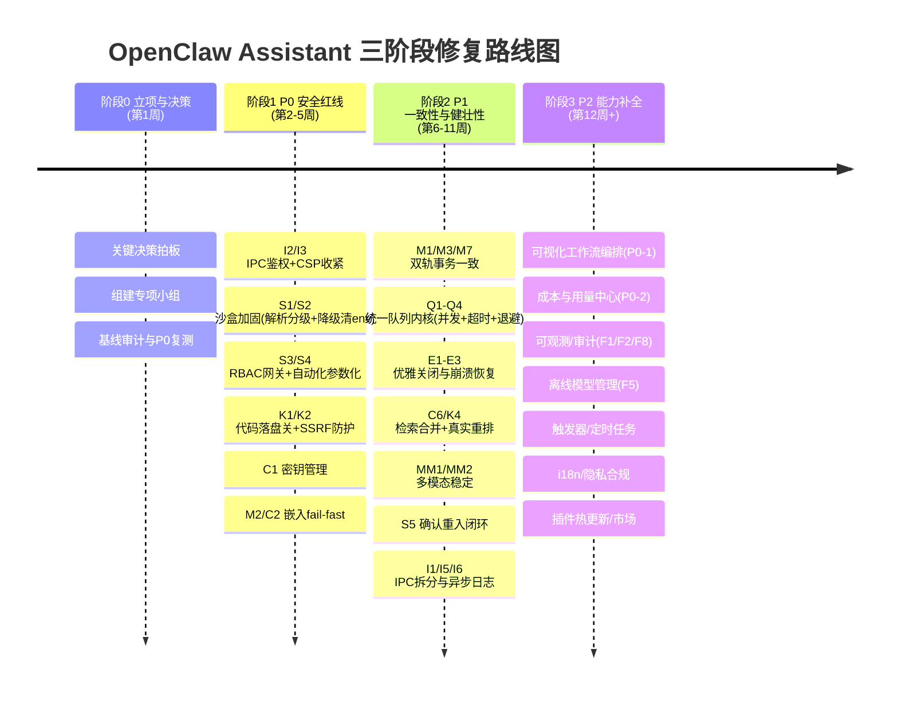

# 文档四：OpenClaw Assistant 总交付报告（含执行排期）

> 编制：软件架构师 高见远（Gao）　|　对象：项目立项 / 向上汇报
> 配套输入：《文档一·竞品对比与功能补充清单》《文档二·现有问题诊断报告》《文档三·软件架构文档》
> 数据基础：实际阅读 `src/` 33 个源文件 + 12 个竞品公开资料归纳
> 范围：v1.0.0 现状评估 + 三阶段修复路线图（P0→P1→P2）+ 关键决策建议 + 待核实跟进

---

## 1. 执行摘要（一页纸）

| 项目 | 结论 |
|------|------|
| **项目定位** | 桌面端、**离线优先**的通用 AI Agent 工作站（Electron 42 + TypeScript 6）；以「数据不出本机 + 本地模型 + 电脑/浏览器真操控 + 知识库自进化 + 专家团」建立差异化护城河，不与 Coze/Dify 云端生态正面竞争。 |
| **竞品覆盖度** | 在 12 个对比产品中，OpenClaw 原生功能覆盖广度**居首**（16 维度中 14 ✅ + 2 🟡 ≈ **93.8%**，评级 **A 领先级**）。六维结构优势：离线本地模型、电脑操控、知识库自进化（全行业唯一）、桌面部署、专家团、跨端同步。 |
| **最大短板** | **安全维度最薄弱**（🔴 严重）。IPC 无鉴权、RBAC 形同虚设、沙盒可被脚本载体绕过并在宿主机继承密钥执行、自动化存在 PowerShell 注入、知识泵/爬虫无 SSRF 防护、evolution 自动落盘 LLM 代码、API Key 密钥硬编码——构成「本地 Agent 执行任意代码」的现实攻击面。**其次为数据一致性**（向量库↔SQLite 双轨失同步、随机嵌入兜底污染相似度）。 |
| **总建议** | **先封红线、再补质量、后扩能力**：① 立项即启动 **P0 安全红线**专项（约 4 人周）；② 随后 1~2 个迭代补齐 **P1 一致性与健壮性**（约 8~12 人周）；③ 最后落地 **P2 能力补全**（约 6~10 人周）。补齐 P0 后即可对外宣称「用户敢用、非技术用户能用」，达到立项可交付基线。 |
| **关键决策（需立项拍板）** | ① 是否默认关闭「evolution 代码自动落盘」→ **建议默认关闭**；② 密钥管理方案 → **系统密钥库优先 + 每机派生兜底，禁止硬编码**；③ 沙盒是否引入容器 → **本期保留「无 Docker 降级」但强制低权/清 env，下期评估 Docker 默认化**。详见第 5 节。 |

> 一句话结论：**OpenClaw 的能力骨架已领先行业，但当前是一道「没有门锁的豪宅」——P0 安全红线不封，不敢放量。** 立项应把 P0 作为发布门槛。

---

## 2. 总体结论

### 2.1 竞品覆盖度结论（来自文档一）

| 维度 | 结论 | 关键证据 |
|------|------|---------|
| 覆盖广度 | **14/16 ✅，2/16 🟡，评级 A（领先级）** | 12 竞品中 ✅ 数量第一（Coze 11、Dify 10、Manus 6，OpenClaw 14） |
| 结构优势（护城河） | 6 项行业领先 | 离线本地模型、电脑/浏览器操控、知识库自进化（唯一原生）、桌面部署、专家团、跨端同步 |
| 行业平齐 | 8 项对齐头部 | 自主循环、RAG、记忆、工具生态、多模态、云端调度、沙盒、基础权限 |
| 薄弱/待核实 | 2 项 🟡 | 可视化工作流编排（缺拖拽画布）、成本与用量控制（缺计量面板）；审计日志细化待核实 |

### 2.2 架构优劣结论（来自文档三）

| 评估项 | 评级 | 说明 |
|--------|------|------|
| 分层清晰度 | 🟢 良好 | renderer / preload(contextIsolation) / ipc / 业务编排 / 领域服务 / 存储 / 后台调度 七层职责清晰 |
| 渲染层 XSS 防护 | 🟢 良好 | `parseMarkdown` 优先 `escapeHtml`，主对话输出已转义（亮点） |
| 通信层 | 🔴 风险 | 单一巨型 `api:call` 路由 + `/memory` 重复定义 + **无鉴权 + RBAC 未生效** |
| 存储一致性 | 🔴 风险 | SQLite 元数据 + JSON 向量库**双轨失同步**，无事务保证 |
| 可扩展性 | 🟠 中等 | 向量库 O(N) 扫描 + 每次全文件重写，KB 增大后成本线性恶化 |
| 健壮性/可观测 | 🟠 中等 | 两套串行队列无超时、无错误恢复、无成本/用量统计、日志仅同步落盘 |

### 2.3 风险总览（综合文档二）

| 维度 | 总体评价 | 关键项 |
|------|---------|--------|
| 架构设计 | 🟢 意图清晰，耦合偏高 | I1、M1、K4、Q1 |
| **安全性** | 🔴 **最薄弱** | I2/I3、S1~S4、K1/K2、C1 |
| 性能 | 🟠 偏重主线程/全量 | M7、C7、MM2、Q2、I6 |
| 可扩展性 | 🟠 向量库线性退化 | vector-store、K4 |
| 用户体验 | 🟠 确认闭环缺失等 | S5、C3 |
| **数据一致性** | 🔴 **系统性隐患** | M1、M3、E1、E2、Q4 |

---

## 3. 风险与优先级总览

> 下列为**全部 🔴P0（安全红线，必须立即）**与**代表性 🟠P1（近期，按模块聚类）**，已标注优先级、严重度、模块归属与一句话影响。

### 3.1 🔴 P0 安全红线（共 11 项，全部来自文档二）

| 编号 | 模块 | 问题（一句话） | 严重度 | 优先级 | 影响面 |
|------|------|---------------|:----:|:----:|------|
| **I2** | IPC | `api:call` 从不校验暴露的 `apiToken`，任意渲染脚本可调全部 IPC | 🔴 | P0 | 鉴权缺失，越权执行 |
| **I3** | IPC | `claw://` 协议 `bypassCSP:true`，叠加 XSS 无阻执行 | 🔴 | P0 | 与 I2 放大危害 |
| **S1** | 沙盒 | 命令风险分级仅靠正则，`node -e`/`python -c` 等载体判 low **零确认执行** | 🔴 | P0 | 主机安全 |
| **S2** | 沙盒 | 无 Docker 时降级宿主机执行且**继承含 API Key 的 `process.env`** | 🔴 | P0 | 凭证泄露 |
| **S3** | 沙盒/权限 | RBAC 定义了却**从未作为 IPC 网关**，默认 `admin` 无身份 | 🔴 | P0 | 越权 |
| **S4** | 自动化 | `automation` 将可控文本直接拼 PowerShell，存在命令注入 | 🔴 | P0 | 启用时 RCE |
| **K1** | 知识自进化 | `evolution-engine` 将 LLM 生成 `.ts` **直接落盘**（潜在 RCE 注入点） | 🔴 | P0 | 代码执行/供应链 |
| **K2** | 知识自进化 | `data-crawler` 无 SSRF 防护，知识泵静默外联任意 URL（含内网） | 🔴 | P0 | 隐私外泄/内网探测 |
| **C1** | 算力调度 | `FALLBACK_SECRET` **硬编码于源码**，加密等于明文混淆 | 🔴 | P0 | 凭证存储 |
| **M2** | 记忆 | `getEmbedding` 缺失返回**随机向量**，污染去重与检索 | 🔴 | P0 | 记忆/RAG 崩塌 |
| **C2** | 算力调度 | 同上（M2 的算力侧表现）：嵌入不可用致 RAG 退化为随机 | 🔴 | P0 | RAG 全局质量 |

### 3.2 🟠 P1 代表性风险（按模块聚类，节选自文档二）

| 模块聚类 | 编号 | 问题（一句话） | 严重度 | 优先级 |
|---------|------|---------------|:----:|:----:|
| 记忆一致性 | M1 | 向量库↔SQLite 双轨失同步，整合删除留孤儿向量 | 🟠 | P1 |
| 记忆一致性 | M3 | 检索读路径触发写库 + 500ms 防抖，崩溃丢写 | 🟠 | P1 |
| 记忆一致性 | M5/M7 | 整分类无长度上限；全量内存 + 整库 export 落盘慢 | 🟠 | P1 |
| 队列/并发 | Q1/Q2/Q3 | 两套串行队列、单作业无超时、卡死阻塞整队 | 🟠 | P1 |
| 队列/并发 | Q4 | `processing` 态任务崩溃后永久卡死、failed 不清理 | 🟠 | P1 |
| 错误恢复 | E1/E2/E3 | 落盘策略不统一；无优雅关闭；崩溃恢复不覆盖 ingestion | 🟠 | P1 |
| 检索质量 | C6/K4 | `getRerankScore` 为桩被混入；两套知识源职责混乱 | 🟠 | P1 |
| 多模态稳定 | MM1/MM2 | tesseract 联网与「离线优先」矛盾；PDF 主线程全量解析 OOM | 🟠 | P1 |
| 确认闭环 | S5 | 沙盒确认即 return，无重入 → Agent 模式下工具不可用 | 🟠 | P1 |
| IPC 重构 | I1/I5/I6 | `/memory` 重复定义；全局单 AbortController 互 abort；同步日志阻塞主线程 | 🟠 | P1 |
| 知识健壮性 | K3/K5 | 核验失败即 FAIL 误杀；单 worker 串行无超时 | 🟠 | P1 |
| 算力质量 | C3/C7 | 双脑路由纯长度误分流；Provider 同步读大附件 base64 入上下文 OOM | 🟠 | P1 |

> 🟡 P2 项（C4/C5、MM3~MM5、S6/S7、I4/I7、K6 等）汇总于文档二 §0.2 风险矩阵，不在此展开，统一纳入第 4 节路线图 P2 阶段。

---

## 4. 分阶段执行路线图（P0 → P1 → P2）

### 4.1 Mermaid 时间线

### 4.2 阶段明细表

| 阶段 | 目标 | 关键任务（痛点编号） | 建议责任方 | 粗略工期 | 阶段间依赖 |
|------|------|-------------------|-----------|---------|-----------|
| **阶段 0** 立项与决策 | 关键决策拍板、组建小组、基线复测 | 第 5 节三项决策评审；P0 复测脚本；CI 安全门禁搭建 | 架构 + 主理人 | **1 周** | 无（前置） |
| **阶段 1** P0 安全红线 | 关闭全部 11 项 P0，达到「可对外发布」安全基线 | ① `api:call` 入口鉴权 + CSP 收敛（I2/I3）② 沙盒命令解析分级 + 解释器载体确认 + 无 Docker 低权/清 env（S1/S2）③ RBAC 网关强制 + 自动化参数化（S3/S4）④ 代码落盘开关 + 落盘前人工校验 + 爬取 SSRF 防护（K1/K2）⑤ 密钥管理方案（C1）⑥ 嵌入 fail-fast + 离线嵌入（M2/C2） | 安全/架构 + 后端 + 前端 | **约 4 人周**（2 人×2 周 或 1 人×4 周） | 依赖阶段 0 决策 |
| **阶段 2** P1 一致性与健壮性 | 消除双轨失同步、队列阻塞、崩溃悬挂；质量达标 | ① 记忆「向量+元数据」事务一致（M1/M3/M7）② 统一队列内核：有界并发+超时+退避+崩溃恢复（Q1~Q4）③ 优雅关闭与崩溃恢复全覆盖（E1/E2/E3）④ 单一持久化检索 + 真实 reranker（C6/K4）⑤ 多模态 worker 流式+大小上限+内置离线 OCR（MM1/MM2）⑥ Agent 确认重入闭环（S5）⑦ `api:call` 拆分模块 handler + 异步日志（I1/I5/I6） | 后端 + 架构 | **约 8~12 人周**（3 人×3~4 周） | 依赖阶段 1（安全基线）；M1 与 Q 系列可并行 |
| **阶段 3** P2 能力补全 | 补齐差异化与成熟度能力 | ① 可视化工作流编排器（P0-1）② 成本与用量控制中心（P0-2）③ RBAC 落地/审计/可观测（F1/F2/F8）④ 离线模型管理（F5）⑤ 触发器与定时任务（P1-4）⑥ i18n/隐私合规/插件热更新（F10/F7/F4） | 前端 + 后端 + 架构 | **约 6~10 人周** | 依赖阶段 2（架构稳定后扩展） |

### 4.3 工期与人力汇总（立项预算参考）

| 阶段 | 人周 | 累计人周 | 占整体 | 里程碑产出 |
|------|:----:|:------:|:----:|-----------|
| 阶段 0 | 1 | 1 | 4% | 决策纪要 + 安全门禁 |
| 阶段 1 (P0) | 4 | 5 | 20% | **可发布安全基线**（发布门槛） |
| 阶段 2 (P1) | 10 | 15 | 56% | 数据一致 + 健壮运行 |
| 阶段 3 (P2) | 8 | 23 | 80%→100% | 差异化能力齐备、对标 Coze/Dify |

> 注：上述为人周（person-week）粗估，未含测试/联调/回归；实际按 1.3~1.5 倍缓冲排期。P0 阶段为**硬发布门槛**，未通过不得进入公测。

---

## 5. 关键决策建议（需立项拍板）

### 决策一：是否默认关闭「evolution 代码自动落盘」

| 选项 | 说明 | 建议 |
|------|------|------|
| A. 默认关闭自动落盘（推荐） | `evolution.autoPersistCode=false`；仅生成代码文本并呈现给用户人工审阅/手动保存，绝不自动 `writeFileSync` 到可加载路径 | ✅ **采用** |
| B. 默认开启但沙箱评审 | 落盘到隔离区，需人工批准 + `vm/worker` 隔离加载 | 风险残留，不建议默认 |
| C. 维持现状 | 自动落盘 `.agents/skills/*.ts` | ❌ 拒绝（K1 红线） |

**建议**：采用 **A**，并将「是否允许自动固化技能」作为设置项中的高危开关，打开时需二次确认 + 提示 RCE 风险。

### 决策二：密钥管理方案选型

| 方案 | 安全性 | 实现成本 | 建议 |
|------|------|---------|------|
| 1. 系统密钥库（electron `safeStorage`）优先 | 高（OS 级加密） | 低 | ✅ **主方案** |
| 2. 每机派生密钥 + 受保护文件（600 权限）兜底 | 中（safeStorage 不可用时） | 中 | ✅ **兜底** |
| 3. 源码硬编码 `FALLBACK_SECRET`（现状） | 极低（等于明文） | — | ❌ **废除（C1）** |

**建议**：**方案 1 优先 + 方案 2 兜底**。移除硬编码常量；首次启动生成随机密钥存入 `safeStorage` 或 `dataDir/.keyring/secret`（权限 600）；解密失败视为密钥丢失，引导用户重新录入 API Key，而非回退到公开常量。

### 决策三：沙盒是否引入容器

| 选项 | 说明 | 建议 |
|------|------|------|
| A. 本期保留「无 Docker 降级」但强制加固 | 降级时清空敏感 env + 限制 PATH + 高危命令需确认/默认禁执行；提示用户安装 Docker 以获得强隔离 | ✅ **本期方案** |
| B. 下期推动 Docker 默认化 | 检测不到 Docker 时引导安装或一键起容器，强隔离成为默认 | 🟡 下期规划（P2） |
| C. 引入 gVisor/microVM 重隔离 | 最强但工程量大 | ❌ 本期不做 |

**建议**：本期采用 **A**——在不强制用户装 Docker 的前提下，把降级路径的凭证泄露与绕过风险压到最低；同时把「容器化沙盒」列入 P2 演进项。

### 其他需拍板项

- **可视化工作流编排（P0-1）与成本中心（P0-2）** 虽在文档一被标为 P0「功能补齐」，但其属「可用性/差异化」而非「安全红线」；建议并入阶段 3（P2）资源池，与 P0 安全红线解耦，避免安全专项被稀释。
- **默认角色**：将 `permission-manager` 默认 `currentRole` 由 `admin` 改为 `user`（S3 配套）。

---

## 6. 待核实项跟进清单

> 汇总三份文档中所有「待核实」点，明确确认责任方与方式，便于立项后逐项关闭。

| # | 待核实内容 | 来源 | 建议责任方 | 确认方式 |
|---|-----------|------|-----------|---------|
| T1 | 可视化工作流编排（维度 3）是否提供**拖拽式节点画布**，还是仅代码/对话编排 | 文档一 §2 评级说明 | 前端 + 产品 | 代码盘点 `renderer/` 是否存在画布组件；若无则确认 P0-1 范围 |
| T2 | 成本与用量控制（维度 15）是否含 token 计量/成本面板 | 文档一 §2 | 前端 + 后端 | 检索 `model-manager`/前端用量页面；确认 C4 现状 |
| T3 | 审计日志细化（维度 14）完备性（who/when/what/result） | 文档一 §2、§3.4 | 架构 + 后端 | 盘点 `sandbox-logs`/操作日志字段覆盖 |
| T4 | `claw://app/...` 文件读取是否存在越权目录穿越（I7） | 文档二 §6.1 | 安全 + 后端 | 静态走查 `main.ts` protocol.handle 路径白名单 |
| T5 | 未读文件相关推断准确性：`openclaw-daemon.ts`、`openclaw-installer.ts`、`system-info.ts`、`renderer/app.ts`、`renderer/components.ts`、`renderer/chat.ts` 全文 | 文档二 §0 方法论 | 后端 + 前端 | 补充通读并复核 S5/I4 结论 |
| T6 | `/models/pull` 等路由在 `utils.ts` 声明但 `ipc-handlers` 是否实现（F5 离线模型管理） | 文档三 §5 | 后端 | 搜索 IPC 路由注册表确认 |
| T7 | `evolution-engine` 生成的 `.ts` 当前是否确无模块 `require` 加载（K1 危害现态） | 文档二 §2.1、文档三 §2.3 | 安全 + 后端 | 全局搜索 `.agents/skills` 的加载点 |
| T8 | `system:getApiToken` 暴露 token 后，渲染层是否还有其他可绕过 contextIsolation 的路径（I2 加固边界） | 文档二 §6.1 | 安全 | 安全审计渲染层所有 `innerHTML`/eval 点 |
| T9 | 降级宿主机执行时 `process.env` 中实际含哪些密钥字段（S2 裁剪清单） | 文档二 §3、本文 §5 决策三 | 后端 + 安全 | 运行态 dump env 名前缀枚举（*KEY/*SECRET/*TOKEN） |

> 跟进原则：**T1~T3 影响功能评级，T4~T8 影响 P0 修复范围，T9 影响 S2 实现细节**；建议立项第 1 周内完成 T1~T8 关闭，T9 随 S2 实现同步确认。

---

## 附件：文档间映射速查

- 竞品覆盖度 → 文档一 §3（评级 A / 93.8%）
- 全部风险矩阵（含 P0/P1/P2 全量） → 文档二 §0.2
- 模块级痛点映射与 ADR → 文档三 §3、§6
- P0 逐项技术修复设计 → 本文配套《文档五·P0 红线逐条修复方案》
- 路线图优先级排布 → 文档三 §4（本文第 4 节在其基础上补充责任方/工期/依赖）

> 本报告可直接用于立项评审。所有结论均可追溯至文档一至三及 `src/` 源码（file:line 见《文档五》）。
